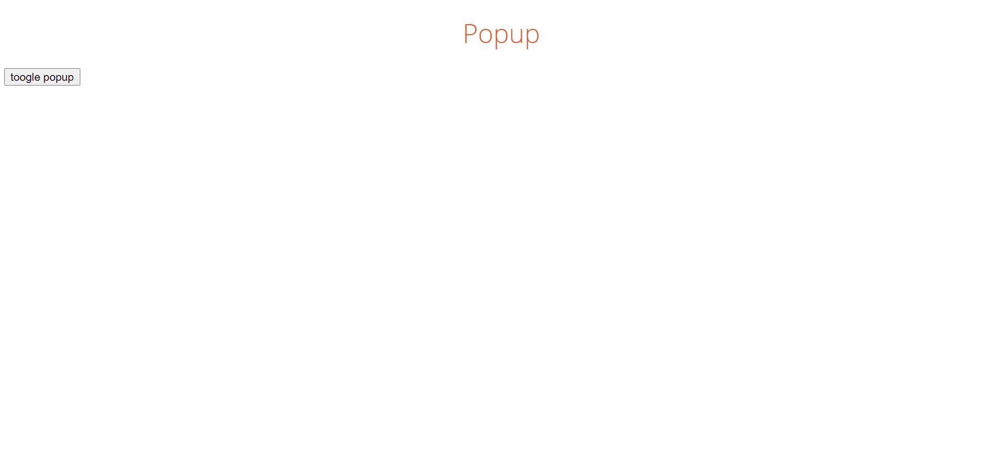

# TIL

- 알고리즘

  - [그리디](https://github.com/hyorard-b/TIL/tree/main/algorithm/greedy)
  - [구현](https://github.com/hyorard-b/TIL/tree/main/algorithm/implementation)

- javascript

  - [simple-UI](https://github.com/hyorard-b/TIL/tree/main/javaScript/simple-UI)

    - [side-nav](https://github.com/hyorard-b/TIL/tree/main/javaScript/simple-UI/side-nav)

      

    - [scroll-top](https://github.com/hyorard-b/TIL/tree/main/javaScript/simple-UI/scroll-top)

      

    - [counter](https://github.com/hyorard-b/TIL/tree/main/javaScript/simple-UI/counter)

      

    - [analog-clock](https://github.com/hyorard-b/TIL/tree/main/javaScript/simple-UI/analog-clock)

      

    - [stop-watch](https://github.com/hyorard-b/TIL/tree/main/javaScript/simple-UI/stop-watch)

      

    - [dark-mode](https://github.com/hyorard-b/TIL/tree/main/javaScript/simple-UI/dark-mode)

      

    - [popup](https://github.com/hyorard-b/TIL/tree/main/javaScript/simple-UI/popup)

      

    - [tab](https://github.com/hyorard-b/TIL/tree/main/javaScript/simple-UI/tab)

      
    
    - [accordion](https://github.com/hyorard-b/TIL/tree/main/javaScript/simple-UI/accordion)

      
    
    - [calendar](https://github.com/hyorard-b/TIL/tree/main/javaScript/simple-UI/calendar)

      

  - [todo-express](https://github.com/hyorard-b/TIL/tree/main/javaScript/todo-express)
