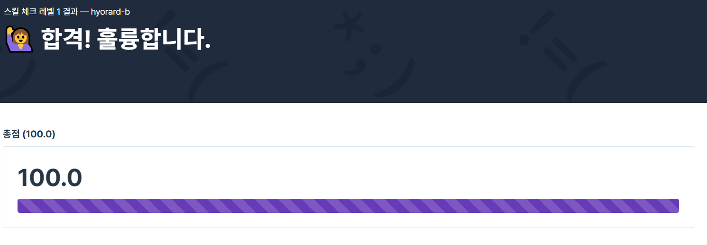

# Homework #1

## 획득 스크린 샷



---

## 문제 1

```javascript

function solution(answers) {
    const surrenders = [[1,2,3,4,5], [2,1,2,3,2,4,2,5], [3,3,1,1,2,2,4,4,5,5]];
    const nCorrect = [0, 0, 0];

    answers.forEach((answer, idx) => {
        surrenders[0][idx % 5] === answer && ++nCorrect[0];
        surrenders[1][idx % 8] === answer && ++nCorrect[1];
        surrenders[2][idx % 10] === answer && ++nCorrect[2];
    });

    const maxCorrect = Math.max(...nCorrect);

    return nCorrect.reduce((answer, v, idx)=> {
        if (v === maxCorrect) answer.push(idx + 1);
        return answer;
    }, []);
}

```

---

## 문제 2

```javascript

function solution(numbers) {
    return numbers.reduce((res, number, idx) => {

        numbers.slice(idx + 1, numbers.length).forEach(n => {
            if (!res.includes(number + n)) res.push(number + n); 
        });

        return res;
    }, []).sort((n1, n2) => n1 - n2);
}

```