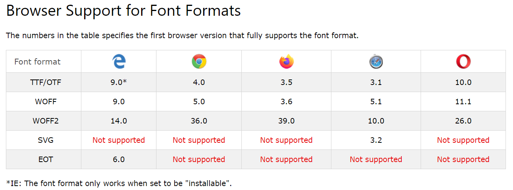

# 2020/10/20 TIL

## HTML5 API

### HTML5에서 사용 가능한 모든 Web API

https://developer.mozilla.org/ko/docs/Web/API

---

### HTML5에 추가된 API

- Canvas API
- Drag and drop API

---

### W3C의 표준에는 없지만, 사용 가능한 것

- Geolocation API
- Web Sockets
- Web GL

https://developer.mozilla.org/ko/docs/Web/HTML/HTML5 - HTML5의 일부로서 포함된 기술

---

## 웹 폰트

### 웹 폰트 형식

1. TTF (True Type Font)

- Mac OS 및 Windows 운영 체제에서 사용하던 폰트이다.

2. EOT (Embedded Open Type)

- IE 8 버전 이하에서 @font-face를 사용할 때 인식할 수 있는 유일한 포맷이다.
- TTF는 EOT로 변환하여 쓸 수 있다.

3. WOFF (Web Open Font Format)

- Mozilla에서 개발된 폰트로, OTF 및 TTF 폰트 구조의 압축 버전을 사용하기 때문에, 다른 포맷보다 빠르다.
- W3C의 권장포맷이다.
- 폰트 내에 메타 데이터 및 라이센스 정보를 포함할 수 있다.

4. WOFF2

- WOFF의 업그레이드 버전
- WOFF2 의 압축 방식은 WOFF의 압축 방식보다 평균적으로 30%, 최대 50% 까지 빠르다.

5. SVG (Scalable Vector Graphics Font)

- SVG 이미지의 단일 벡터 객체인 것처럼 SVG 요소 및 속성으로 표현된 텍스트 파일
- EOT, WOFF 등의 폰트와 다르게 압축이 안되며, 크기가 크다
- 가장 큰 단점은 폰트의 힌팅(외곽선을 렌더링할 때 필요한 추가 정보)을 제공하지 않아, 폰트의 크기가 작거나 작은 해상도에서 깨져보일 수 있다.

### 현재 다양한 브라우저와 최신 버전 ( 2020/10/20 기준 )

- 크롬 86.0
- 파이어폭스 81.0.2
- IE EDGE 86.0.6

### 형식별 지원 브라우저 버전



출처 - https://www.w3schools.com/Css/css3_fonts.asp

---

## 수평 정렬 방법

### 1. inline-block

_수평 정렬하려는 요소_

```CSS
display: inline-block;
```

- 부작용 발생 : HTML에서 인라인 요소 태그를 들여쓰기 하거나 띄워쓰면, 사용자에게 요소간 아주 작은 공백 발생 ( 인라인으로 간주하기 때문 )

_해결 방법_

```CSS
부모요소 {
    font-size: 0;
}
해당요소 {
    font-size: some size;
}
```

제한 사항이 있음!

---

### 2. float

- 작동 방식 - float된 요소는 line box를 만들어, 그것을 기준으로 삼아 띄워진다.

```CSS
.someClass{
    float: left;
}
```

- 부모 요소 안에 float된 요소밖에 없었다면, 부모 요소의 `height`은 `auto`가 된다.

```CSS
.parentClass{
    height: auto;
}
```

- `float`된 박스와 그렇지 않은 박스는 겹쳐지게 되지만,
  안의 인라인 요소(텍스트)는 안 겹쳐지고 박스 바깥으로 밀려난다.

- 하나의 라인박스로 float된 요소들의 너비를 감당할 수 없으면
  넘치기 시작한 박스 부터 밑에 새로운 라인박스 생성하고 그쪽에서 다시 `float`

---

### clearfix

1. clear & block

```CSS
.clearfix::after{
    content: "";
    clear: both;
    display: block;
}
```

display를 블록으로 주는 이유 : clear는 inline요소에 안먹음 -> content는 inline요소

2. overflow

```CSS
.부모요소{
    overflow: hidden;
}
```

`hidden` 부작용 발생

- `overflow`의 기본값은 `visible`로, 부모 요소 안의 자식 요소들이 부모 요소의 크기를 벗어나더라도 자동으로 부모 요소의 크기를 늘려 보여주는 값이다.
- `overflow`를 `hidden`으로 설정하면, 자식 요소들의 크기가 더 크다면, 더 표시할 내용(자식 요소들의 내용)이 있음에도 불구하고, 부모 요소가 잘라버려, 표시할 수 없게 된다.

```CSS
.부모요소{
    overflow: auto;
}
```

`auto` 부작용 발생

- 자식 요소들의 크기가 더 크다면, 부모 요소에 스크롤 바가 생긴다.

### 3. flex

### 4. grid

---

### 결론

overlow보단 clearfix방식이 더 낫고,
float 방식보단 flex방식이 더 낫다.

---

## reference

https://developer.mozilla.org/ko/docs/Web/API
https://developer.mozilla.org/ko/docs/Web/HTML/HTML5
https://knulab.com/archives/1191
https://d2.naver.com/helloworld/4969726
https://spoqa.github.io/2017/02/15/using-shs-as-webfonts.html
https://www.w3schools.com/Css/css3_fonts.asp
