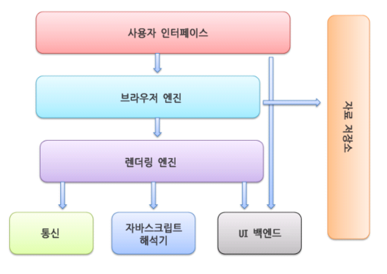
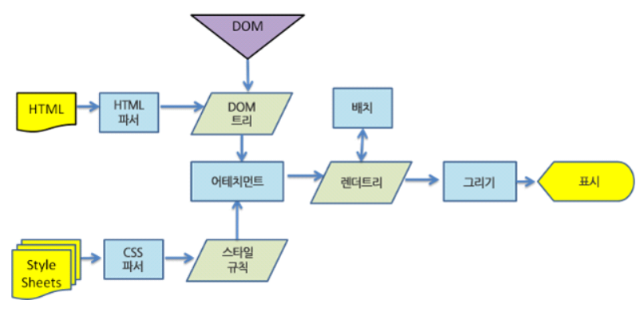
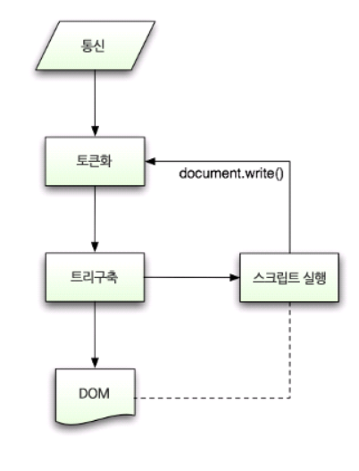
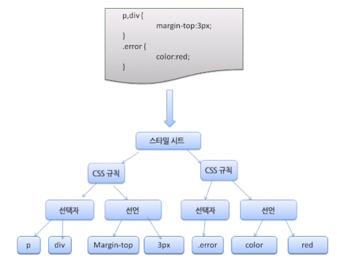

# vertical-align

`vertical-align` 속성은 `inline`, `table-cell` 요소에만 적용할 수 있다. 포함된 line box 내부에서 수직정렬하고자 할 때, 사용하는 속성이다.

```HTML
<section class="container">
  this is container
  <span class="vertical">some text</span>
</section>
```

```CSS
.container{
  height: 100px;
  background: tomato;
  font-size: 2rem;
}
.vertical{
  background: cyan;
  font-size: 1rem;
  vertical-align: 20%;
}
```

[코드펜 연습장](https://codepen.io/hyorard-b/pen/oNLZOqP)

`vertical-align` 속성의 값으로,

- baseline : 초기값, 부모의 baseline에 맞춤
- sub : 요소의 baseline을 부모의 subscript-baseline으로 정렬
- super : 요소의 baseline을 부모의 superscript-baseline으로 정렬
- text-top : 요소의 top을 부모의 폰트 top으로 정렬
- text-bottom
- middle : 요소의 middle을 부모의 baseline + x-height / 2로 정렬
- `<length>` : 요소의 baseline을 부모의 baseline에서 주어진 길이만큼 **위로** 정렬
- `<percentage>` : `<length>` 와 동일

`<length>` 와 `<percentage>`에 음수 값을 지정할 수 있다.

- top : 요소의 top과 자손들의 top을 전체 라인의 top으로 정렬
- bottom : 요소의 bottom과 자손들의 bottom을 전체 라인의 bottom으로 정렬

# WAI ARIA role 속성

`role` 속성을 통해 시맨틱 태그를 바꾸는 것은 권장하지 않는다.

`<h2 role="button">공지사항</h2>` 과 같이 사용하기 보다는 `div`태그와 같이 역할이 없는 태그에 `role` 속성을 사용하는 것이 적합하다.

그러나, `a` 태그와 `button` 태그와 같이 역할이 비슷한 경우, `<h2><a href="#" role="button">공지사항</a></h2>` 과 같이 사용할 수 있다.

그렇다면, 애초에 왜`<h2><button>공지사항</button></h2>` 과 같이 사용하지 않는걸까?

이것은 `h2` 태그를 사용하는 이유가 없어지기 때문이다. 또한, 자바스크립트로 제어할 때 `button` 태그보다 `a`태그가 제어하기 더 쉽기 때문이다. enter키로 제어할 때, `button`태그는 `keydown` 속성을 따로 사용해서 제어해야 하지만, `a`태그는 `click` 속성만으로 제어할 수 있기 때문이다.

# 웹 폰트 작동 원리

웹 폰트란 로컬의 폰트 설치 상황에 상관 없이 웹에서 항상 원하는 타이포그래피를 사용할 수 있게 하는 기술이다.

기본 사용법은 CSS의 `@font-face` 규칙을 사용해 적용한다.

```CSS
@font-face {
  font-family: NanumSquare; /*폰트 이름 설정*/
  src: url(https://ssl.pstatic.net/static/kin/fonts/NanumSquareR.woff2) format("woff2");
}

.title{
  font-family: NanumSquare, AppleSDGothicNeo, sans-serif;
}
```

`@font-face` 규칙에는 두 가지 세부 속성이 있다.

- `font-family` : 사용할 웹 폰트의 이름을 지정한다. 이름은 폰트 파일의 이름과 일치하지 않아도 되지만, 비슷하게 설정하는 것이 유지 보수에 용이하다.
- `src` : 폰트 파일의 경로와 폰트의 형식을 지정한다. `url`에 폰트 파일의 경로를 설정하고, `format`에 폰트 파일의 형식을 설정한다.

`@font-face` 규칙을 설정한 다음 웹 폰트가 필요한 선택자의 `font-family` 속성에서 호출하여 사용할 때, 만약 해당 웹 폰트의 로딩이 실패할 경우를 대비해 다른 폰트들을 나열하고, 최소 한 개의 폰트 계열(generic family)을 추가해야 한다. 이를 폴백 폰트(fallback font)라고 한다.

# 브라우저의 기본 구조


출처 : [네이버 D2](https://d2.naver.com/helloworld/59361)

- 사용자 인터페이스 : 요청한 페이지를 보여주는 창을 제외한 나머지. 주소창, 뒤로가기/앞으로 가기 버튼, 설정 버튼, 북마크 메뉴 등
- 브라우저 엔진 : 사용자 인터페이스와 렌더링 엔진 사이의 동작을 제어. 이전에 공부했던 V8 엔진이 여기 해당하는 줄 알았는데, 이게 아니고 렌더링 엔진 중 자바스크립트 해석기에 해당하는 것 같다.
- 렌더링 엔진 : 요청한 컨텐츠를 표시한다. 뒤에 자세히 알아보자

렌더링 엔진의 역할은 요청 받은 내용을 브라우저 화면에 표시하는 것이다. 대표적인 렌더링 엔진에는 웹킷(webkit)과 모질라의 게코(Gecko)엔진이 있다. 크롬을 많이 쓰니까 웹킷 엔진을 공부해보자.


출처 : [네이버 D2](https://d2.naver.com/helloworld/59361)
웹킷은 HTML,CSS를 각각 파싱한다(javascript는 선언 방식에 따라 달라짐 근데 선언 방식도 결국 HTML 파서가 만나면 ㅇㅇ 방식 달라지는거). HTML 파서는 DOM 트리를 구축한다. DOM 트리 구축 과정은 다음 사진과 같다.

출처 : [네이버 D2](https://d2.naver.com/helloworld/59361)
동시에 CSS 파서는 CSS 파일을 파싱하여 최종적으로는 스타일 규칙 객체를 생성한다. 웹킷은 CSS 파일로부터 자동으로 파서를 생성하기 위해 플렉스와 바이슨이라는 파서 생성기를 사용한다(파이어폭스는 자체 제작 파서 사용). 과정은 다음 사진과 같다.

출처 : [네이버 D2](https://d2.naver.com/helloworld/59361)

생성된 DOM 트리와 스타일 규칙 객체들을 합쳐 렌더트리를 탄생시킨다..! 이 합치는 과정을 웹킷에서는 "어태치먼트(attachment)"라고 부른다. 모든 DOM 노드에는 "attach" 메소드가 있다. 어태치먼트는 동기적인데 DOM 트리에 노드를 추가하면 새 노드의 "attach" 메소드를 호출한다.(DOM이랑 스타일 규칙 객체를 만들어 놓고, 이거 두개 합치면서 attach 메소드 호출하여 렌더러(렌더트리)를 만든다는 것인지, DOM에서 새 노드를 추가하면서 동시에 스타일 규칙을 적용하고, attach 메소드를 호출해서 렌더러(렌더트리)를 DOM이랑 같이 만든다는 건지 잘 모르겠다.) 렌더 트리는 다음과 같이 생겼다.

출처 : [네이버 D2](https://d2.naver.com/helloworld/59361)

그 다음 배치와 그리기가 시작된다.. 배치와 그리기는.. 브라우저를 믿으면 될 것 같다..

# 더 알아봐야 할 것

웹 폰트의 문제점, webkit에서 javascript 선언 방식에 따른 차이점 정리

# Reference

[MDN - vertical-align](https://developer.mozilla.org/ko/docs/Web/CSS/vertical-align)
[네이버 D2 - 웹 폰트 사용과 최적화의 최근 동향](https://d2.naver.com/helloworld/4969726)
[MDN - font-family](https://developer.mozilla.org/ko/docs/Web/CSS/font-family)
[네이버 D2 - 브라우저는 어떻게 동작하는가?](https://d2.naver.com/helloworld/59361)
