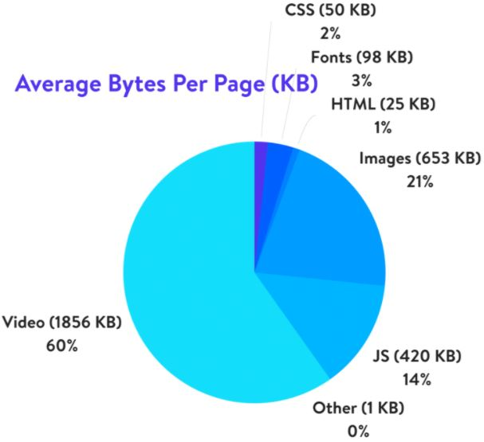

# 브라우저 성능 최적화 - 이미지 최적화

출처 : [kinsta.com/blog](https://kinsta.com/blog/optimize-images-for-web/)

---

**!이미지를 최적화 하는 이유!**

페이지에 비디오가 없다면 이미지가 데이터 용량 50% 이상을 차지한다. 이러한 이미지를 최적화한다면,

1. 사이트 성능 향상
2. 브라우저 다운로드 해야하는 바이트 절약
3. 클라이언트 대역폭에 여유
4. 신속하게 화면에 렌더링 가능
5. 서버의 저장 공간 절약 ( = 비용 절감 )
6. 최적의 사용자 경험 ( = 사이트 이용률 상승, 사이트 방문자 40%는 3초 안에 웹 페이지 로딩 안되면 떠나버린다고 한다)
7. SEO 최적화에 도움 (구글의 SEO 순위를 결정할 때 모바일 응답성을 고려하기 때문이다)

를 해낼 수 있다.

출처 : [Jacob's Development Blog](https://code-masterjung.tistory.com/60)

---

**그렇다면 어떻게 이미지를 최적화하나?**

1. 불필요한 이미지 리소스 제거

통 이미지 쓰지 말고, 텍스트는 텍스트 등 요소 별로 나누어야 한다.

2. CSS 활용 해라

스프라이트 기법 & 여백은 CSS로 주기

스프라이트 기법을 쓸 경우 하나의 이미지만 요청하기 때문에 서버 요청수가 줄어들며, 네트워크 대역폭을 절약할 수 있어 렌더링이 빨라진다.

여백이 있는 이미지는 여백을 제거한 이미지를 쓰고, 여백을 CSS로 주는 것이 효율적이다.

---

**이미지 별 최적화 포맷은?**

용도 별로 다른 이미지 포맷을 써야 한다.
최근에 WebP, JPEG2000, JPEGXR 등의 성능과 사이즈 측면에서 효율적인 이미지들이 있지만, 브라우저 호환성이 떨어진다.

이미지 포맷은 크게 두 가지로 나눌 수 있다.

1. 픽셀을 사용하는 래스터 이미지 ( JPEG, PNG ..)
2. 벡터 이미지 ( SVG )

래스터 이미지는 확대할 때 이미지가 손상된다는 단점을 가지고 있으나, 벡터 이미지는 확대하여도 이미지에 손상이 없다는 점이 가장 큰 차이다.

그러나, 벡터 이미지가 항상 좋은 것은 아니다. 이미지를 연산을 통해 그리기 때문에, 불규칙한 패턴을 가지거나 복잡한 이미지의 경우 파일의 사이즈가 래스터 이미지에 비해 비약적으로 늘어난다.

그렇다면, 용도마다 이미지의 포맷을 다르게 써야하겟다..! JPEG, PNG, SVG 파일을 비교해보자.

1. JPEG

- JPEG 포맷이 가장 파일 크기가 작기 때문에 가장 효율적이라고 할 수 있다. 그러나 사이트의 질적인 측면을 고려할 때, JPEG 포맷은 손실 압축 방식을 사용하기 때문에, 이미지의 크기를 확대할 때, 이미지에 큰 손상이 간다. 따라서, JPEG 포맷은 복잡한 이미지이면서, 이미지 크기가 변할 가능성이 작거나 없을 때 사용하는 것이 바람직할 것이다. 보통 배경 이미지로 쓰인다.

2. PNG

- PNG 포맷은 JPEG에 비해 이미지 크기가 변할 때, 손상이 적다. 따라서, 복잡한 이미지이면서, 크기가 변할 가능성이 큰 경우 사용하는 것이 바람직하다.

3. SVG

- SVG 포맷은 크기에 상관 없이 이미지가 단순할 때 사용해야 한다. 래스터 이미지는 패턴이 단순하더라도 이미지의 크기가 커지면, 파일의 크기도 덩달아 커지지만, 벡터 이미지는 패턴이 단순하다면, 이미지의 크기가 커져도 파일의 크기가 커지지 않는다. 또한, svg 스프라이트 기법을 사용해 네트워크 대역폭을 줄일 수 있기 때문에, 같은 이미지인데 크기가 래스터 이미지와 비슷하다면 SVG를 써야한다.
