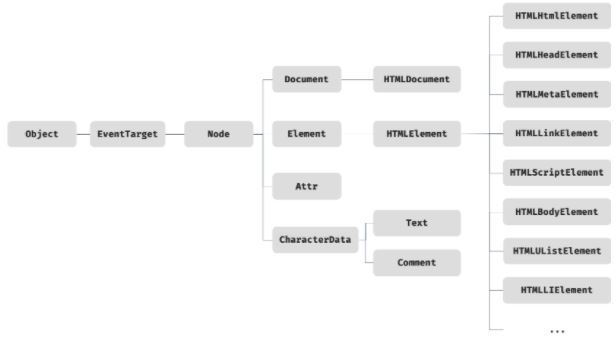

# DOM

DOM(Document Object Model)은 HTML 문서의 계층적 구조와 정보를 표현하며 이를 제어할 수 있는 API, 즉 프로퍼티와 메서드를 제공하는 트리 자료구조이다.

---

## 노드

### HTML 요소와 노드 객체

HTML 요소는 렌더링 엔진에 의해 파싱되어 DOM을 구성하는 요소 노드 객체로 변환된다. 이때 HTML 요소의 어트리뷰트는 어트리뷰트 노드로, HTML 요소의 텍스트 콘텐츠는 텍스트 노드로 변환된다.


HTML 요소 간에는 중첩 관계에 의해 계층적인 부자(parent-child) 관계가 형성된다. 이러한 HTML 요소 간의 부자 관계를 반영하여 HTML 문서의 구성 요소인 HTML 요소를 객체화한 모든 노드 객체들을 트리 자료구조로 구성한다.

---

### 노드 객체의 타입

노드 객체는 총 12개의 타입이 있는데, 중요한 노드 타입은 다음과 같다.

1. 문서 노드

   DOM 트리 최상위에 존재하는 루트 노드로, document 객체를 가리킨다. document 객체는 브라우저가 렌더링한 HTML 문서 전체를 가리키는 객체로, 전역 객체 window의 document 프로퍼티에 바인딩되어 있다.

   script 태그로 분리되어 있어도 자바스크립트 코드들은 하나의 전역 객체 window를 공유하기 때문에, window.document도 공유하게 되며, 이는 HTML 문서당 document 객체는 유일함을 말한다.

   문서 노드는 DOM 트리의 노드들에 접근하기 위한 진입점 역할을 담당한다.

2. 요소 노드

   요소 노드는 HTML 요소 간의 중첩에 의한 부자 관계를 가지며, 이를 통해 정보를 구조화하여 문서의 구조를 표현한다.

3. 어트리뷰트 노드

   어트리뷰트 노드에는 요소 노드만 연결되어 있기 때문에, 어트리뷰트 노드에 접근하기 위해서는 먼저 요소 노드에 접근하여야 한다. 요소 노드가 어트리뷰트 노드의 부모 노드는 아니며, 어트리뷰트 노드의 부모 노드는 존재하지 않는다.

4. 텍스트 노드

   요소 노드가 문서의 구조를 표현한다면, 텍스트 노드는 문서의 정보를 표현한다. 텍스트 노드는 요소 노드의 자식이며, 자식 노드를 가질 수 없는 리프 노드이기 때문에, DOM 트리의 최종단에 위치한다.

---

### 노드 객체의 상속 구조

노드 객체는 표준 빌트인 객체가 아닌 호스트 객체이다. 그럼에도 자바스크립트 객체이기 때문에 프로토타입에 의한 상속 구조를 갖는다.



모든 노드 객체는 Object, EventTarget, Node 인터페이스를 상속받는다. 추가로 문서 노드는 Document, HTMLDocument 인터페이스를 상속받고 어트리뷰트 노드는 Attr, 텍스트 노드는 CharacterData 인터페이스를 각각 상속받는다. 요소 노드는 Element 인터페이스를 상속받는다. 또한 요소 노드는 추가적으로 HTMLElement와 태그의 종류별로 세분화된 HTMLHtmlElement, HTMLHeadElement, HTMLBodyElement, HTMLUListElement 등의 인터페이스를 상속받는다.

다음은 input 요소 노드의 프로토타입 체인이다.


---

## 요소 노드 취득

요소 노드의 취득은 HTML 요소를 조작하는 시작점이다. 이를 위해 DOM은 요소 노드를 취득할 수 있는 다양한 메서드를 제공한다.

1. id를 이용한 요소 노드 취득

   `Document.prototype.getElementById` 메서드는 인수로 전달한 id 어트리뷰트 값(이하 id 값)을 갖는 하나의 요소 노드를 탐색하여 반환한다. `getElementById` 메서드는 `Document.prototype`의 프로퍼티다. 따라서 반드시 문서 노드인 document를 통해 호출해야 한다.

   `getElementById` 메서드는 인수로 전달된 id 값을 갖는 첫 번째 요소 노드만 반환한다. 즉, `getElementById` 메서드는 언제나 단 하나의 요소 노드를 반환한다. 만약 인수로 전달된 id 값을 갖는 HTML 요소가 존재하지 않는 경우 getElementById 메서드는 null을 반환한다.

   HTML 요소에 id 어트리뷰트를 부여하면 id 값과 동일한 이름의 전역 변수가 암묵적으로 선언되고 해당 노드 객체가 할당되는 부수 효과가 있다. 단, id 값과 동일한 이름의 전역 변수가 이미 선언되어 있으면 이 전역 변수에 노드 객체가 재할당되지 않는다.

2. 태그 이름을 이용한 요소 노드 취득

   `Document.prototype/Element.prototype.getElementsByTagName` 메서드는 인수로 전달한 태그 이름을 갖는 모든 요소 노드들을 탐색하여 반환한다. 메서드 이름에 포함된 Elements가 복수형인 것에서 알 수 있듯이 `getElementsByTagName` 메서드는 여러 개의 요소 노드 객체를 갖는 DOM 컬렉션 객체인 HTMLCollection 객체를 반환한다. `getElementsByTagName` 메서드가 반환하는 DOM 컬렉션 객체인 HTMLCollection 객체는 유사 배열 객체이면서 이터러블이다.

   HTML 문서의 모든 요소 노드를 취득하려면 getElementsByTagName 메서드의 인수로 ‘\*‘를 전달한다.

   Element.prototype.getElementsByTagName 메서드는 특정 요소 노드를 통해 호출하며, 특정 요소 노드의 자손 노드 중에서 요소 노드를 탐색하여 반환한다.

   만약 인수로 전달된 태그 이름을 갖는 요소가 존재하지 않는 경우 `getElementsByTagName` 메서드는 빈 HTMLCollection 객체를 반환한다.

3. class를 이용한 요소 노드 취득

   `Document.prototype/Element.prototype.getElementsByClassName` 메서드는 인수로 전달한 class 어트리뷰트 값(이하 class 값)을 갖는 모든 요소 노드 들을 탐색하여 반환한다.

   나머지는 `getElementByTagName`과 같다.

4. CSS 선택자를 이용한 요소 노드 취득

   CSS 선택자(selector)는 스타일을 적용하고자 하는 HTML 요소를 특정할 때 사용하는 문법이다. `Document.prototype/Element.prototype.querySelector` 메서드는 인수로 전달한 CSS 선택자를 만족시키는 하나의 요소 노드를 탐색하여 반환한다.

   선택자를 만족시키는 요소가 여러 개일 경우 첫 번째 요소 노드만, 없을 경우 `null`을, 선택자가 문법에 맞지 않는 경우 `DOMException` 에러가 발생한다.

   `ocument.prototype/Element.prototype.querySelectorAll` 메서드는 CSS 선택자를 만족시키는 모든 요소 노드를 탐색하여 반환한다.

   `querySelectorAll` 메서드는 여러 개의 요소 노드 객체를 갖는 DOM 컬렉션 객체인 NodeList 객체를 반환한다. NodeList 객체는 유사 배열 객체이면서 이터러블이다.

   CSS 선택자 문법을 사용하는 `querySelector`, `querySelectorAll` 메서드는 `getElementById`, `getElementsBy***` 메서드보다 다소 느린 것으로 알려져 있다. 하지만 CSS 선택자 문법을 사용하여 좀 더 구체적인 조건으로 요소 노드를 취득할 수 있고 일관된 방식으로 요소 노드를 취득할 수 있다는 장점이 있다.

---

### 특정 요소 노드를 취득할 수 있는지 확인

`Element.prototype.matches` 메서드는 인수로 전달한 CSS 선택자를 통해 특정 요소 노드를 취득할 수 있는지 확인한다.

---

### HTMLCollection과 NodeList

HTMLCollection과 NodeList는 DOM API가 여러 개의 결과값을 반환하기 위한 DOM 컬렉션 객체다. HTMLCollection과 NodeList는 모두 유사 배열 객체이면서 이터러블이다. 따라서 `for…of` 문으로 순회할 수 있으며 스프레드 문법을 사용하여 간단히 배열로 변환할 수 있다.

HTMLCollection은 언제나 live 객체로 동작한다. 단, NodeList는 대부분의 경우 노드 객체의 상태 변화를 실시간으로 반영하지 않고 과거의 정적 상태를 유지하는 non-live 객체로 동작하지만 경우에 따라 live 객체로 동작할 때가 있다.

1. HTMLCollection

   `getElementsByTagName`, `getElementsByClassName` 메서드가 반환하는 HTMLCollection 객체는 노드 객체의 상태 변화를 실시간으로 반영하는 살아 있는(live) DOM 컬렉션 객체다. 따라서 HTMLCollection 객체를 살아 있는(live) 객체라고 부르기도 한다.

   live 객체이기 때문에, 취득하게 된 조건을 `for`문을 이용해 바꾸게 된다면, 돌리는 중에 삭제되기 때문에, 의도대로 동작하지 않을 수 있다. 이 경우 `for`문을 역방향으로 순회하는 방법으로 회피한다.

   더 간단한 해결책은 부작용을 발생시키는 원인인 HTMLCollection 객체를 사용하지 않는 것이다. 유사 배열 객체이면서 이터러블인 HTMLCollection 객체를 배열로 변환하면 부작용을 발생시키는 HTMLCollection 객체를 사용할 필요가 없고 유용한 배열의 고차 함수(forEach, map, filter, reduce 등)를 사용할 수 있다.

2. NodeList

   `querySelectorAll` 메서드는 DOM 컬렉션 객체인 NodeList 객체를 반환한다. 이때 NodeList 객체는 실시간으로 노드 객체의 상태 변경을 반영하지 않는(non-live) 객체다.

   NodeList 객체는 `NodeList.prototype.forEach` 메서드를 상속받아 사용할 수 있다. `NodeList.prototype.forEach` 메서드는 `Array.prototype.forEach` 메서드와 사용방법이 동일하다. `NodeList.prototype`은 forEach 외에도 `item`, `entries`, `keys`, `values` 메서드를 제공한다.

   `childNodes` 프로퍼티가 반환하는 NodeList 객체는 HTMLCollection 객체와 같이 실시간으로 노드 객체의 상태 변경을 반영하는 live 객체로 동작하므로 주의가 필요하다.

   노드 객체의 상태 변경과 상관없이 안전하게 DOM 컬렉션을 사용하려면 HTMLCollection이나 NodeList 객체를 배열로 변환하여 사용하는 것이 좋다.

---

## 노드 탐색

요소 노드를 취득한 다음, 취득한 요소 노드를 기점으로 DOM 트리의 노드를 옮겨 다니며 부모, 형제, 자식 노드 등을 탐색(traversing, node walking)해야 할 때가 있다.

`parentNode`, `previousSibling,` `firstChild`, `childNodes` 프로퍼티는 `Node.prototype`이 제공하고, 프로퍼티 키에 Element가 포함된 `previousElementSibling`, `nextElementSibling`과 `children` 프로퍼티는 `Element.prototype`이 제공한다.

노드 탐색 프로퍼티는 모두 접근자 프로퍼티다. 단, 노드 탐색 프로퍼티는 setter없이 getter만 존재하여 참조만 가능한 읽기 전용 접근자 프로퍼티다. 읽기 전용 접근자 프로퍼티에 값을 할당하면 아무런 에러 없이 무시된다.

---

### 공백 텍스트 노드

HTML 요소 사이의 스페이스, 탭, 줄바꿈(개행) 등의 공백(white space) 문자는 텍스트 노드를 생성한다. 이를 공백 텍스트 노드라 한다.

---

### 자식 노드 탐색

<table>
   <tr>
      <th>프로퍼티</th>
      <th>설명</th>
   </tr>
   <tr>
      <td>Node.prototype.childNodes</td>
      <td>자식 노드를 모두 탐색하여 NodeList에 담아 반환한다. childNodes 프로퍼티가 반환한 NodeList에는 요소 노드뿐만 아니라 텍스트 노드도 포함되어 있을 수 있다.</td>
   </tr>
   <tr>
      <td>Element.prototype.children</td>
      <td>
         자식 노드 중 요소 노드만 탐색하여 HTMLCollection에 담아 반환한다. 텍스트 노드가 포함되지 않는다.
      </td>
   </tr>
   <tr>
      <td>Node.prototype.firstChild</td>
      <td>
         첫 번째 자식 노드를 반환한다. 텍스트 노드 또는 요소 노드가 될 수 있다.
      </td>
   </tr>
   <tr>
      <td>Node.prototype.lastChild</td>
      <td>
         마지막 자식 노드를 반환한다. 텍스트 노드 또는 요소 노드가 될 수 있다.
      </td>
   </tr>
   <tr>
      <td>Element.prototype.firstElementChild</td>
      <td>
         첫 번째 자식 요소 노드만을 반환한다.
      </td>
   </tr>
   <tr>
      <td>Element.prototype.lastElementChild</td>
      <td>
         마지막 자식 요소 노드만을 반환한다.
      </td>
   </tr>
</table>

---

### 자식 노드 존재 확인

자식 노드가 존재하는지 확인하려면 `Node.prototype.hasChildNodes` 메서드를 사용한다. `hasChildNodes` 메서드는 `childNodes` 프로퍼티와 마찬가지로 텍스트 노드를 포함하여 자식 노드의 존재를 확인한다.

자식 노드 중에 텍스트 노드가 아닌 요소 노드가 존재하는지는 확인하려면 `hasChildNodes` 메서드 대신 `children.length` 또는 Element 인터페이스의 `childElementCount` 프로퍼티를 사용한다.

---

### 요소 노드의 텍스트 노드 탐색

요소 노드의 텍스트 노드는 요소 노드의 자식 노드다. 따라서 요소 노드의 텍스트 노드는 `firstChild` 프로퍼티로 접근할 수 있다. `firstChild` 프로퍼티는 첫 번째 자식 노드를 반환한다. `firstChild` 프로퍼티가 반환한 노드는 텍스트 노드이거나 요소 노드다.

---

### 부모 노드 탐색

부모 노드를 탐색하려면 `Node.prototype.parentNode` 프로퍼티를 사용한다. 텍스트 노드는 DOM 트리의 최종단 노드인 리프 노드(leaf node)이므로 부모 노드가 텍스트 노드인 경우는 없다.

---

### 형제 노드 탐색

<table>
   <tr>
      <th>프로퍼티</th>
      <th>설명</th>
   </tr>
   <tr>
      <td>Node.prototype.previousSibling</td>
      <td>부모 노드가 같은 형제 노드 중에서 자신의 이전 형제 노드를 탐색하여 반환한다. 텍스트 노드일 수 있다.</td>
   </tr>
   <tr>
      <td>Node.prototype.nextSibling</td>
      <td>부모 노드가 같은 형제 노드 중에서 자신의 다음 형제 노드를 탐색하여 반환한다. 텍스트 노드일 수 있다.</td>
   </tr>
   <tr>
      <td>Element.prototype.previousElementSibling</td>
      <td>부모 노드가 같은 형제 요소 노드 중에서 자신의 이전 형제 요소 노드만을 반환한다.</td>
   </tr>
   <tr>
      <td>Element.prototype.nextElementSibling</td>
      <td>부모 노드가 같은 형제 요소 노드 중에서 자신의 다음 형제 요소 노드만을 반환한다.</td>
   </tr>
</table>

---

## 노드 정보 취득

노드 객체에 대한 정보를 취득하려면 다음과 같은 노드 정보 프로퍼티를 사용한다.

<table>
   <tr>
      <th>프로퍼티</th>
      <th>설명</th>
   </tr>
   <tr>
      <td>Node.prototype.nodeType</td>
      <td>
         노드 객체의 종류를 나타내는 상수를 반환한다.
         - 1 -> 요소 노드 타입을 나타냄
         - 3 -> 텍스트 노드 타입을 나타냄
         - 9 -> 문서 노드 타입을 나타냄
      </td>
   </tr>
   <tr>
      <td>Node.prototype.nodeName</td>
      <td>
         노드의 이름을 문자열로 반환한다.
         - 요소 노드 -> 태그 이름 반환
         - 텍스트 노드 -> 문자열 "#text"를 반환
         - 문서 노드 -> 문자열 "#document"를 반환 
      </td>
   </tr>
</table>

---

## 요소 노드의 텍스트 조작

### nodeValue

지금까지 살펴본 노드 탐색, 노드 정보 프로퍼티는 모두 읽기 전용 접근자 프로퍼티다. 지금부터 살펴볼 `Node.prototype.nodeValue` 프로퍼티는 setter와 getter 모두 존재하는 접근자 프로퍼티다. 따라서 `nodeValue` 프로퍼티는 참조와 할당 모두 가능하다.

노드 객체의 `nodeValue` 프로퍼티를 참조하면 노드 객체의 값을 반환한다. 노드 객체의 값이란 텍스트 노드의 텍스트다. 따라서 텍스트 노드가 아닌 노드, 즉 문서 노드나 요소 노드의 `nodeValue` 프로퍼티를 참조하면 `null`을 반환한다.

요소 노드를 취득한 다음, 해당 노드의 `firstchild` 프로퍼티가 가리키고 있는 텍스트 노드의 `nodeValue` 프로퍼티를 참조한다.

---

### textContent

`Node.prototype.textContent` 프로퍼티는 setter와 getter 모두 존재하는 접근자 프로퍼티로서 요소 노드의 텍스트와 모든 자손 노드의 텍스트를 모두 취득하거나 변경한다.

요소 노드의 `textContent` 프로퍼티를 참조하면 요소 노드의 콘텐츠 영역(시작 태그와 종료 태그 사이) 내의 텍스트를 모두 반환한다. 다시 말해, 요소 노드의 `childNodes` 프로퍼티가 반환한 모든 노드들의 텍스트 노드의 값, 즉 텍스트를 모두 반환한다. 이때 HTML 마크업은 무시된다.

요소 노드의 `textContent` 프로퍼티에 문자열을 할당하면 요소 노드의 모든 자식 노드가 제거되고 할당한 문자열이 텍스트로 추가된다. 이때 할당한 문자열에 HTML 마크업이 포함되어 있더라도 문자열 그대로 인식되어 텍스트로 취급된다. 즉, **HTML 마크업이 파싱되지 않는다.**

`innerText` 프로퍼티는 `textContent` 프로퍼티와 유사한 동작을 하지만, CSS에 순종적이기 때문에, `visibility: hidden`과 같이 비표시로 지정되면 요소 노드의 텍스트를 반환하지 않는다. 또한, CSS를 고려하기 때문에 `textContent` 프로퍼티보다 느리다.

---

## DOM 조작

DOM 조작(DOM manipulation)은 새로운 노드를 생성하여 DOM에 추가하거나 기존 노드를 삭제 또는 교체하는 것을 말한다. DOM 조작에 의해 DOM에 새로운 노드가 추가되거나 삭제되면 리플로우와 리페인트가 발생하는 원인이 되므로 성능에 영향을 준다.

---

### innerHTML

`Element.prototype.innerHTML` 프로퍼티는 setter와 getter 모두 존재하는 접근자 프로퍼티로서 요소 노드의 HTML 마크업을 취득하거나 변경한다. 요소 노드의 `innerHTML` 프로퍼티를 참조하면 요소 노드의 콘텐츠 영역(시작 태그와 종료 태그 사이) 내에 포함된 모든 HTML 마크업을 문자열로 반환한다.

앞서 살펴본 `textContent` 프로퍼티를 참조하면 HTML 마크업을 무시하고 텍스트만 반환하지만 `innerHTML` 프로퍼티는 HTML 마크업이 포함된 문자열을 그대로 반환한다.

요소 노드의 `innerHTML` 프로퍼티에 문자열을 할당하면 요소 노드의 모든 자식 노드가 제거되고 할당한 문자열에 포함되어 있는 **HTML 마크업이 파싱되어** 요소 노드의 자식 노드로 DOM에 반영된다.

요소 노드의 `innerHTML` 프로퍼티에 할당한 HTML 마크업 문자열은 렌더링 엔진에 의해 파싱되어 요소 노드의 자식으로 DOM에 반영된다. 이때 사용자로부터 입력 받은 데이터(untrusted input data)를 그대로 `innerHTML` 프로퍼티에 할당하는 것은 크로스 사이트 스크립팅 공격(XSS: Cross-Site Scripting Attacks)에 취약하므로 위험하다. HTML 마크업 내에 자바스크립트 악성 코드가 포함되어 있다면 파싱 과정에서 그대로 실행될 가능성이 있기 때문이다.

`innerHTML` 프로퍼티의 또 다른 단점은 요소 노드의 `innerHTML` 프로퍼티에 HTML 마크업 문자열을 할당하는 경우 요소 노드의 모든 자식 노드를 제거하고 할당한 HTML 마크업 문자열을 파싱하여 DOM을 변경한다는 것이다. `innerHTML` 프로퍼티에 HTML 마크업 문자열을 할당하면 유지되어도 좋은 기존의 자식 노드까지 모두 제거하고 다시 처음부터 새롭게 자식 노드를 생성하여 DOM에 반영한다. 이는 효율적이지 않다.

`innerHTML` 프로퍼티의 단점은 이뿐만이 아니다. `innerHTML` 프로퍼티는 새로운 요소를 삽입할 때 삽입될 위치를 지정할 수 없다는 단점도 있다.

---

### insertAdjacentHTML 메서드

`Element.prototype.insertAdjacentHTML(position, DOMString)` 메서드는 기존 요소를 제거하지 않으면서 위치를 지정해 새로운 요소를 삽입한다.

`insertAdjacentHTML` 메서드는 두 번째 인수로 전달한 HTML 마크업 문자열(DOMString)을 파싱하고 그 결과로 생성된 노드를 첫 번째 인수로 전달한 위치(position)에 삽입하여 DOM에 반영한다. 첫 번째 인수로 전달할 수 있는 문자열은 ‘beforebegin’, ‘afterbegin’, ‘beforeend’, ‘afterend’의 4가지다.

`insertAdjacentHTML` 메서드는 기존 요소에는 영향을 주지 않고 새롭게 삽입될 요소만을 파싱하여 자식 요소로 추가하므로 기존의 자식 노드를 모두 제거하고 다시 처음부터 새롭게 자식 노드를 생성하여 자식 요소로 추가하는 `innerHTML` 프로퍼티보다 효율적이고 빠르다.

단, `innerHTML` 프로퍼티와 마찬가지로 `insertAdjacentHTML` 메서드는 HTML 마크업 문자열을 파싱하므로 크로스 사이트 스크립팅 공격에 취약하다는 점은 동일하다.

---

### 노드 생성과 추가

DOM은 노드를 직접 생성/삽입/삭제/치환하는 메서드도 제공한다.

`DocumentFragment` 노드는 문서, 요소, 어트리뷰트, 텍스트 노드와 같은 노드 객체의 일종으로, 부모 노드가 없어서 기존 DOM과는 별도로 존재한다는 특징이 있다. `DocumentFragment` 노드는 별도의 서브 DOM을 구성하여 기존 DOM에 추가하기 위한 용도로 사용한다. `DocumentFragment` 노드는 기존 DOM과는 별도로 존재하므로 `DocumentFragment` 노드에 자식 노드를 추가하여도 기존 DOM에는 어떠한 변경도 발생하지 않는다. 또한 `DocumentFragment` 노드를 DOM에 추가하면 자신은 제거되고 자신의 자식 노드만 DOM에 추가된다.

```HTML

<!DOCTYPE html>
<html>
  <body>
    <ul id="fruits">
      <li>Apple</li>
    </ul>
  </body>
  <script>
    const $fruits = document.getElementById('fruits');

    // 1. 요소 노드 생성
    const $li = document.createElement('li');

    // 2. 텍스트 노드 생성
    const textNode = document.createTextNode('Banana');

    // 3. 텍스트 노드를 $li 요소 노드의 자식 노드로 추가
    $li.appendChild(textNode); // $li 요소 노드에 자식 노드가 없을 것이기 때문에 textContent 프로퍼티로 텍스트를 삽입하는 것이 더욱 간편하다.

    // 4. $li 요소 노드를 #fruits 요소 노드의 마지막 자식 노드로 추가
    $fruits.appendChild($li);

    // 복수 요소 노드 생성 및 DOM에 추가
    // DOM 3번 변경 = 3번의 리플로우, 리페인트
    ['orange', 'kiwi', 'strawberry'].forEach(text => {
       const $li = document.createElement('li');
       const textNode = document.createTextNode(text);
       $li.appendChild(textNode);
       $fruits.appendChild($li);
    });

    const $container = document.createElement('div');

    // DOM 변경 최소화 -> 컨테이너 요소 생성 및 DOM에 추가
    ['fruit1', 'fruit2', 'fruit3'].forEach(fruit => {
       const $li = document.createElement('li');
       const textNode = document.createTextNode(fruit);
       $li.appendChild(textNode);
       $container.appendChild($li);
    });

    $fruits.appendChild($container); // DOM 변경은 최소화하였으나, 불필요한 태그가 DOM에 추가되었음

   // DocumentFragment 노드 사용하여 DOM 변경 최소화 및 생성한 서브 DOM만 기존 DOM에 추가

   const $fragment = document.createDocumentFragment();

   ['fruit4', 'fruit5', 'fruit6'].forEach(fruit => {
       const $li = document.createElement('li');
       const textNode = document.createTextNode(fruit);
       $li.appendChild(textNode);
       $fragment.appendChild($li);
    });

    $fruits.appendChild($fragment);

  </script>
</html>

```

---

### 노드 삽입

1. 마지막 노드로 추가

   `Node.prototype.appendChild` 메서드는 인수로 전달받은 노드를 자신을 호출한 노드의 마지막 자식 노드로 DOM에 추가한다. 이때 노드를 추가할 위치를 지정할 수 없고 언제나 마지막 자식 노드로 추가한다.

2. 지정한 위치에 노드 삽입

   `Node.prototype.insertBefore(newNode, childNode)` 메서드는 첫 번째 인수로 전달받은 노드를 두 번째 인수로 전달받은 노드 앞에 삽입한다.

   두 번째 인수로 전달받은 노드는 반드시 `insertBefore` 메서드를 호출한 노드의 자식 노드이어야 한다. 그렇지 않으면 `DOMException` 에러가 발생한다.

   두 번째 인수로 전달받은 노드가 `null`이면 첫 번째 인수로 전달받은 노드를 `insertBefore` 메서드를 호출한 노드의 마지막 자식 노드로 추가된다. 즉, `appendChild` 메서드처럼 동작한다.

---

### 노드 이동

DOM에 이미 존재하는 노드를 `appendChild` 또는 `insertBefore` 메서드를 사용하여 DOM에 다시 추가하면 현재 위치에서 노드를 제거하고 새로운 위치에 노드를 추가한다. 즉, 노드가 이동한다.

---

### 노드 복사

`Node.prototype.cloneNode([deep: true | false])` 메서드는 노드의 사본을 생성하여 반환한다. 매개변수 `deep`에 `true`를 인수로 전달하면 노드를 깊은 복사(deep copy)하여 모든 자손 노드가 포함된 사본을 생성하고, `false`를 인수로 전달하거나 생략하면 노드를 얕은 복사(shallow copy)하여 노드 자신만의 사본을 생성한다. 얕은 복사로 생성된 요소 노드는 자손 노드를 복사하지 않으므로 텍스트 노드도 없다.

---

### 노드 교체

`Node.prototype.replaceChild(newChild, oldChild)` 메서드는 자신을 호출한 노드의 자식 노드를 다른 노드로 교체한다. 첫 번째 매개변수 `newChild`에 교체할 새로운 노드를 인수로 전달하고, 두 번째 매개변수 `oldChild`에는 이미 존재하는 교체될 노드를 인수로 전달한다. `oldChild` 매개변수에 인수로 전달한 노드는 `replaceChild` 메서드를 호출한 노드의 자식 노드이어야 한다.

`replaceChild` 메서드는 자신을 호출한 노드의 자식 노드인 `oldChild` 노드를 `newChild` 노드로 교체한다. 이때 `oldChild` 노드는 DOM에서 제거된다.

---

### 노드 삭제

`Node.prototype.removeChild(child)` 메서드는 `child` 매개변수에 인수로 전달한 노드를 DOM에서 삭제한다. 인수로 전달한 노드는 `removeChild` 메서드를 호출한 노드의 자식 노드이어야 한다.

---

## 어트리뷰트

### 어트리뷰트 노드와 attributes 프로퍼티

HTML 문서가 파싱될 때 HTML 요소의 어트리뷰트(이하 HTML 어트리뷰트)는 어트리뷰트 노드로 변환되어 요소 노드와 연결된다. 이때 HTML 어트리뷰트당 하나의 어트리뷰트 노드가 생성된다.

이때 모든 어트리뷰트 노드의 참조는 유사 배열 객체이자 이터러블인 `NamedNodeMap` 객체에 담겨서 요소 노드의 `attributes` 프로퍼티에 저장된다.

따라서 요소 노드의 모든 어트리뷰트 노드는 요소 노드의 `Element.prototype.attributes` 프로퍼티로 취득할 수 있다. `attributes` 프로퍼티는 getter만 존재하는 읽기 전용 접근자 프로퍼티이며, 요소 노드의 모든 어트리뷰트 노드의 참조가 담긴 `NamedNodeMap` 객체를 반환한다.

---

### HTML 어트리뷰트 조작

요소 노드의 `attributes` 프로퍼티는 getter만 존재하는 읽기 전용 접근자 프로퍼티이므로 HTML 어트리뷰트 값을 취득할 수 있지만 변경할 수는 없다. 또한 `attributes.id.value`와 같이 `attributes` 프로퍼티를 통해야만 HTML 어트리뷰트 값을 취득할 수 있기 때문에 불편하다.

`Element.prototype.getAttribute/setAttribute` 메서드를 사용하면 `attributes` 프로퍼티를 통하지 않고 요소 노드에서 메서드를 통해 직접 HTML 어트리뷰트 값을 취득하거나 변경할 수 있어서 편리하다.

HTML 어트리뷰트 값을 참조하려면 `Element.prototype.getAttribute(attributeName)` 메서드를 사용하고, HTML 어트리뷰트 값을 변경하려면 `Element.prototype.setAttribute(attributeName, attributeValue)` 메서드를 사용한다.

특정 HTML 어트리뷰트가 존재하는지 확인하려면 `Element.prototype.hasAttribute(attributeName)` 메서드를 사용하고, 특정 HTML 어트리뷰트를 삭제하려면 `Element.prototype.removeAttribute(attributeName)` 메서드를 사용한다.

---

### HTML 어트리뷰트 vs DOM 프로퍼티

요소 노드 객체에는 HTML 어트리뷰트에 대응하는 프로퍼티(이하 DOM 프로퍼티)가 존재한다. 이 DOM 프로퍼티들은 HTML 어트리뷰트 값을 초기값으로 가지고 있다.

DOM 프로퍼티는 setter와 getter 모두 존재하는 접근자 프로퍼티다. 따라서 DOM 프로퍼티는 참조와 변경이 가능하다.

따라서, HTML 어트리뷰트는 DOM에서 중복 관리되고 있는 것처럼 보인다. HTML 어트리뷰트의 역할은 HTML 요소의 초기 상태를 지정하는 것이다. 즉, HTML 어트리뷰트 값은 HTML 요소의 초기 상태를 의미하며 이는 변하지 않는다. 첫 렌더링 이후 사용자가 input 요소에 무언가를 입력하기 시작하면 달라진다.

요소 노드는 2개의 상태, 즉 초기 상태와 최신 상태를 관리해야 한다. 요소 노드의 초기 상태는 어트리뷰트 노드가 관리하며, 요소 노드의 최신 상태는 DOM 프로퍼티가 관리한다. 초기 상태를 관리해야 웹 페이지를 처음 표시하거나 새로고침할 때 초기 상태를 표기할 수 있기 때문이다.

---

### 어트리뷰트 노드

HTML 어트리뷰트로 지정한 HTML 요소의 초기 상태는 어트리뷰트 노드에서 관리한다. `getAttribute` 메서드로 취득한 값은 어트리뷰트 노드에서 관리하는 HTML 요소에 지정한 어트리뷰트 값, 즉 초기 상태 값이다. HTML 요소에 지정한 어트리뷰트 값은 사용자의 입력에 의해 변하지 않으므로 결과는 언제나 동일하다. `setAttribute` 메서드는 어트리뷰트 노드에서 관리하는 HTML 요소에 지정한 어트리뷰트 값, 즉 초기 상태 값을 변경한다.

---

### DOM 프로퍼티

사용자가 입력한 최신 상태는 HTML 어트리뷰트에 대응하는 요소 노드의 DOM 프로퍼티가 관리한다. DOM 프로퍼티는 사용자의 입력에 의한 상태 변화에 반응하여 언제나 최신 상태를 유지한다.

DOM 프로퍼티에 값을 할당하는 것은 HTML 요소의 최신 상태 값을 변경하는 것을 의미한다. 즉, 사용자가 상태를 변경하는 행위와 같다. 이때 HTML 요소에 지정한 어트리뷰트 값에는 어떠한 영향도 주지 않는다. 단, 모든 DOM 프로퍼티가 사용자의 입력에 의해 변경되는 최신 상태를 관리하는 것은 아니다.

사용자 입력에 의한 상태 변화와 관계없는 id 어트리뷰트와 id 프로퍼티는 사용자 입력과 관계없이 항상 동일한 값을 유지한다. 즉, id 어트리뷰트 값이 변하면 id 프로퍼티 값도 변하고 그 반대도 마찬가지다. 사용자 입력에 의한 상태 변화와 관계없는 어트리뷰트와 DOM 프로퍼티는 항상 동일한 값으로 연동한다.

---

### HTML 어트리뷰트와 DOM 프로퍼티의 대응 관계

대부분의 HTML 어트리뷰트는 HTML 어트리뷰트 이름과 동일한 DOM 프로퍼티와 1:1로 대응한다. 단, 다음과 같이 HTML 어트리뷰트와 DOM 프로퍼티가 언제나 1:1로 대응하는 것은 아니며, HTML 어트리뷰트 이름과 DOM 프로퍼티 키가 반드시 일치하는 것도 아니다.

- class 어트리뷰트는 className, classList 프로퍼티와 대응한다.
- for 어트리뷰트는 htmlFor 프로퍼티와 1:1 대응한다.
- td 요소의 colspan 어트리뷰트는 대응하는 프로퍼티가 존재하지 않는다.
- textContent 프로퍼티는 대응하는 어트리뷰트가 존재하지 않는다.

---

### DOM 프로퍼티 값의 타입

`getAttribute` 메서드로 취득한 어트리뷰트 값은 언제나 문자열이다. 하지만 DOM 프로퍼티로 취득한 상태 값은 문자열이 아닐 수도 있다. 예를 들어, checkbox 요소의 `checked` 어트리뷰트 값은 문자열이지만 `checked` 프로퍼티 값은 불리언 타입이다.

---

### data 어트리뷰트와 dataset 프로퍼티

`data` 어트리뷰트와 `dataset` 프로퍼티를 사용하면 HTML 요소에 정의한 사용자 정의 어트리뷰트와 자바스크립트 간에 데이터를 교환할 수 있다. `data` 어트리뷰트는 `data-user-id`, `data-role`과 같이 `data-` 접두사 다음에 임의의 이름을 붙여 사용한다.

`data` 어트리뷰트의 값은 `HTMLElement.dataset` 프로퍼티로 취득할 수 있다. `dataset` 프로퍼티는 HTML 요소의 모든 `data` 어트리뷰트의 정보를 제공하는 `DOMStringMap` 객체를 반환한다. `DOMStringMap` 객체는 `data` 어트리뷰트의 `data-` 접두사 다음에 붙인 임의의 이름을 카멜 케이스(camelCase)로 변환한 프로퍼티를 가지고 있다. 이 프로퍼티로 `data` 어트리뷰트의 값을 취득하거나 변경할 수 있다.

`data` 어트리뷰트의 `data-` 접두사 다음에 존재하지 않는 이름을 키로 사용하여 `dataset` 프로퍼티에 값을 할당하면 HTML 요소에 `data` 어트리뷰트가 추가된다. 이때 `dataset` 프로퍼티에 추가한 카멜케이스(fooBar)의 프로퍼티 키는 `data` 어트리뷰트의 `data-` 접두사 다음에 케밥케이스(data-foo-bar)로 자동 변경되어 추가된다.

---

## 스타일

### 인라인 스타일 조작

`HTMLElement.prototype.style` 프로퍼티는 setter와 getter 모두 존재하는 접근자 프로퍼티로서 요소 노드의 **인라인 스타일(inline style)** 을 취득하거나 추가 또는 변경한다.

`style` 프로퍼티를 참조하면 CSSStyleDeclaration 타입의 객체를 반환한다. CSSStyleDeclaration 객체는 다양한 CSS 프로퍼티에 대응하는 프로퍼티를 가지고 있으며, 이 프로퍼티에 값을 할당하면 해당 CSSS 프로퍼티가 인라인 스타일로 HTML 요소에 추가되거나 변경된다.

CSS 프로퍼티는 케밥 케이스(kebab-case)를 따른다. 이에 대응하는 CSSStyleDeclaration 객체의 프로퍼티는 카멜 케이스를 따른다. 예) `$div.style.backgroundColor = 'yellow';`

케밥 케이스의 CSS 프로퍼티를 그대로 사용하려면 객체의 마침표 표기법 대신 대괄호 표기법을 사용한다. 예) `$div.style['background-color'] = 'tomato';`

단위 지정이 필요한 CSS 프로퍼티의 값은 반드시 단위를 지정해야 한다. 예를 들어, px, em, % 등의 크기 단위가 필요한 width 프로퍼티에 값을 할당할 때 단위를 생략하면 해당 CSS 프로퍼티는 적용되지 않는다.

---

### 클래스 조작

HTML 요소의 class 어트리뷰트를 조작하려면 class 어트리뷰트에 대응하는 요소 노드의 DOM 프로퍼티를 사용한다. 이는 곧 `className`과 `classList`이다. JS에서 `class`는 예약어이기 때문이다.

1. className

   `Element.prototype.className` 프로퍼티는 setter와 getter 모두 존재하는 접근자 프로퍼티로서 HTML 요소의 `class` 어트리뷰트 값을 취득하거나 변경한다.

   `className` 프로퍼티는 문자열을 반환하므로 공백으로 구분된 여러 개의 클래스를 반환하는 경우 다루기가 불편하다.

2. classList

   `Element.prototype.classList` 프로퍼티는 `class` 어트리뷰트의 정보를 담은 DOMTokenList 객체를 반환한다.

   DOMTokenList 객체는 HTMLCollection과 NodeList와 같이 노드 객체의 상태 변화를 실시간으로 반영하는 살아 있는 객체다. DOMTokenList 객체는 `class` 어트리뷰트의 정보를 나타내는 컬렉션 객체로서 유사 배열 객체이면서 이터러블이다.

   - add(...className)

     인수로 전달한 1개 이상의 문자열을 `class` 어트리뷰트 값으로 추가한다.

   - remove(...className)

     인수로 전달한 1개 이상의 문자열과 일치하는 클래스를 `class` 어트리뷰트에서 삭제한다. 일치하는 클래스가 없다면 에러 없이 무시된다.

   - item(index)

     인수로 전달한 index에 해당하는 클래스를 반환한다.

   - contains(className)

     인수로 전달한 문자열과 일치하는 클래스가 `class` 어트리뷰트에 포함되어 있는지 확인한다.

   - replace(oldClassName, NewClassName)

     첫 번째 인수로 전달한 문자열에 해당하는 `class` 어트리뷰트에서 찾아 두 번째 인수로 전달한 문자열로 변경한다.

   - toggle(className[,force])

     `class` 어트리뷰트에 인수로 전달한 문자열과 일치하는 클래스가 존재하면 제거하고, 존재하지 않으면 추가한다.

---

### 요소에 적용되어 있는 CSS 스타일 참조

`style` 프로퍼티는 인라인 스타일만 반환한다. 따라서 클래스를 적용한 스타일이나 상속을 통해 암묵적으로 적용된 스타일은 `style` 프로퍼티로 참조할 수 없다. HTML 요소에 적용되어 있는 모든 CSS 스타일을 참조해야 할 경우 `getComputedStyle` 메서드를 사용한다.

`window.getComputedStyle(element[, pseudo])` 메서드는 첫 번째 인수(element)로 전달한 요소 노드에 적용되어 있는 평가된 스타일을 CSSStyleDeclaration 객체에 담아 반환한다. 평가된 스타일(computed style)이란 요소 노드에 적용되어 있는 모든 스타일, 즉 링크 스타일, 임베딩 스타일, 인라인 스타일, 자바스크립트에서 적용한 스타일, 상속된 스타일, 기본(user agent) 스타일 등 모든 스타일이 조합되어 최종적으로 적용된 스타일을 말한다.

---

## DOM 표준

HTML과 DOM 표준은 W3C(World Wide Web Consortium)과 WHATWG(Web Hypertext Application Technology Working Group)이라는 두 단체가 나름대로 협력하면서 공통된 표준을 만들어 왔다.

그런데 두 단체가 서로 다른 결과물을 내놓기 시작했다. 별개의 HTML과 DOM 표준을 만드는 것은 이롭지 않으므로 2018년 4월부터 구글, 애플, 마이크로소프트, 모질라로 구성된, 4개의 주류 브라우저 벤더사가 주도하는 WHATWG이 단일 표준을 내놓기로 두 단체가 합의했다.
