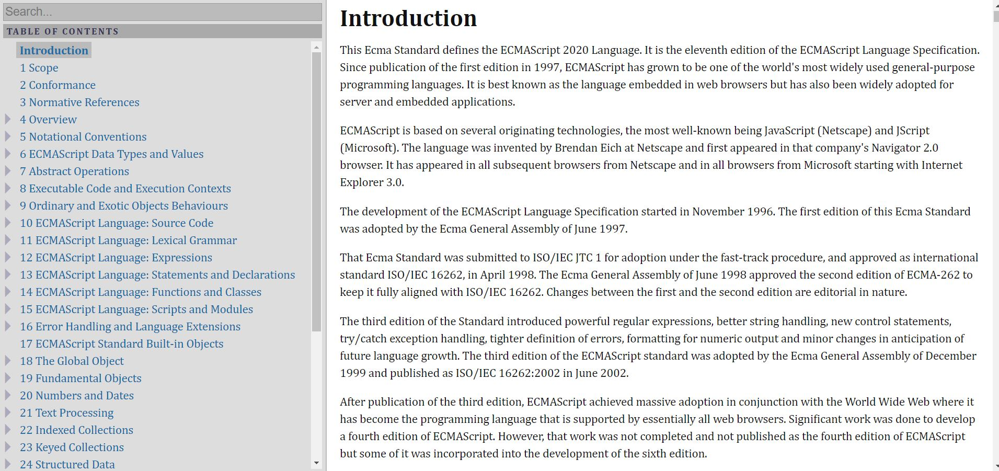
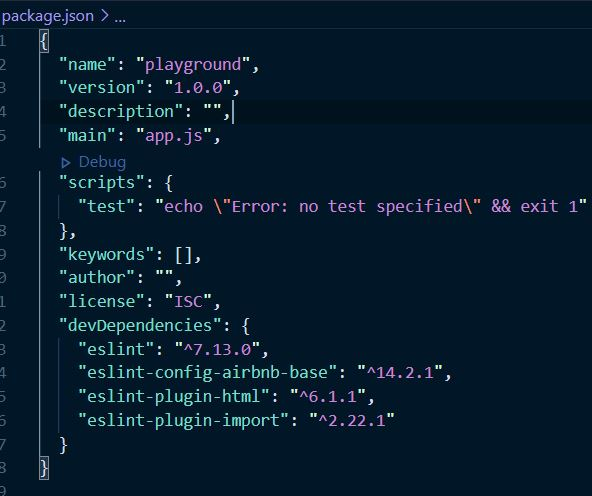
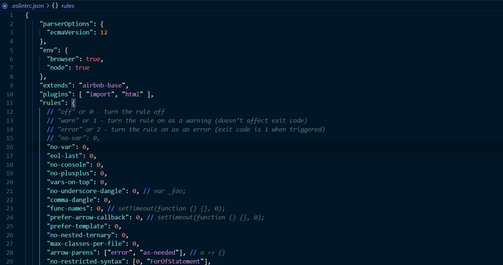
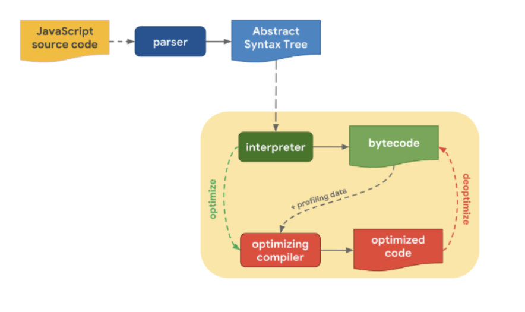
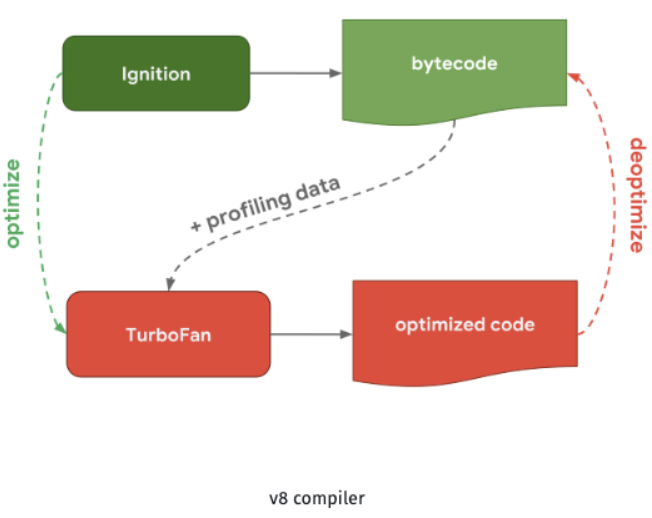

# 오늘 배운 것

**script 언어**

응용 프로그램과는 독립적이며, 사용자가 직접 프로그램을 의도에 따라 동작시킬 수 있도록 설계된 프로그래밍 언어이다. 대표적으로 Javascript가 있다.

---

**ECMA 인터내셔널**

정보 통신에 대한 표준을 제정하는 비영리 표준화기구이다. 대표적으로 CD롬 볼륨과 파일 구조, C# 언어 규격, JSON 포맷처럼 일부 정보 통신 기술에 대한 표준을 관리하고 있다. 1994년 이전에는 "European Computer Manufacturers Association" 로 알려져 있었지만, 이후 기구가 세계화된 이후에도 "ECMA"라는 트레이드마크는 지키도록 하였다.

[ECMA 인터내셔널 - 역사](https://www.ecma-international.org/memento/history.htm)

---

**ECMA-262**

ECMA 인터내셔널에 의해 제정된 하나의 기술 규격의 이름으로, 범용 목적의 스크립트 언어에 대한 명세를 담고 있다.

[ECMA 인터내셔널 - ECMA-262](https://www.ecma-international.org/ecma-262/11.0/index.html#title)

---

**ECMAscript**

ECMAscript는 ECMA 인터내셔널에 의해 제정된 ECMA-262 기술 규격에 의해 정의된 범용 스크립트 언어이다. 스크립트 언어가 준수해야 하는 규칙, 세부 사항 및 지침을 제공한다.

2009 ECMA-262 (ES5)

2011 ECMA-262 (ES5.1)

2015 ECMA-262 2015 (ES6)

2016 ECMA-262 2016 (ES7)

2017 ECMA-262 2017 (ES8)

2018 ECMA-262 9th Edition

2019 ECMA-262 10th Edition

---

**Javascript**

ECMAscript 사양을 준수하는 범용 스크립트 언어이다. ECMAscript 보다 좀 더 넓은 영역을 가지고 있다. Javascript는 브라우저와 Node.js 라는 두 가지의 대표적인 런타임 환경을 가진다. 그리고 Javascript는 ECMAscript를 비롯해, 브라우저에서 지원하는 Javascript의 API와 Node.js에서 지원하는 Javascript의 API까지 포함되어 있기 때문에 ECMAscript보다 더 넓은 영역을 가지는 것이다.

---

**package.json**

`package.json`에는 패키지에 관한 정보와 의존중인 버전에 관한 정보를 담고 있다. 각 속성에 대해 알아보자.

- name (필수)

  폴더의 이름을 담고 있다.

- version (필수)

  `메이저.마이너.패치` 와 같이 3단계로 구성된다. 메이저는 대규모, 마이너는 소규모 업데이트이며, 패치는 버그 수정 시에 버전을 올린다.

  각 버전 앞에 붙을 수 있는 기호로는 `^`,`~`,`><=`,`x`,`latest`가 있다.
  아무 기호도 붙어 있지 않는 경우에는 무조건 그 버전을 설치해야 한다는 것을 뜻한다.
  `^`는 메이저까지 패치 버전을 허용하고, `~`는 마이너까지 패치 버전을 허용하는 것이다. 예를 들어, `"eslint": "^7.13.0"`은 eslint의 7.20.0 버전 등 까지는 허용하지만, 8.0.0 버전은 허용하지 않는 것이고, `"eslint": "~7.13.0"`은 eslint의 7.13.20 버전 등까지는 허용하지만 7.14.0 이후는 허용하지 않는 것을 뜻한다.
  부등호는 말 그대로를 뜻하며, `x`는 그 표시를 쓴 숫자는 어느 것이든 괜찮다는 뜻이며, `latest`는 가장 최신 버전을 사용해라는 것이다.

- description과 keywords

  각각 설명과 키워드를 알려주어 사람들이 검색할 때 쉽게 찾을 수 있게 한다.

- private

  이 패키지를 비공개할 것인지의 여부를 알려준다.

- bugs

  버그가 발생할 시 제보할 곳을 알려준다.

- author

  제작자의 정보를 알려준다.

- repository

  이 코드가 저장되어 있는 곳의 정보를 알려준다.

- main

  패키지의 메인 파일이 무엇인지를 알려준다.

- scripts

  여러가지 npm 명령어를 알려준다. 위의 사진의 경우 `npm test` 명령어를 실행하면, 뒤의 코드가 실행되게 된다.
  `publish`, `uninstall`, `start`, `restart`, `test`, `version` 등의 유형이 있다.
  `build` 명령어를 만들었다면, `npm run build` 명령어를 실행해야 한다.

- dependencies

  의존중인 패키지들의 버전을 기록하는 곳이다. dependencies에는 일반적인 경우 의존하고 있는 패키지들의 버전을 기록한다.

- devDependencies

  개발 모드일 때만 의존하고 있는 버전을 기록하는 곳이다. 실제로 배포할 때는 필요없는 테스트 도구나 웹팩, 바벨같은 것들을 넣는다.

- peerDependencies

  직접 require은 하지 않지만, 호환되는 패키지들의 목록이다. 주로 어떤 패키지의 플러그인 같은 것을 개발할 때 사용한다.

Reference

[제로초 블로그 - package.json](https://www.zerocho.com/category/NodeJS/post/5825a3caaff5c70018279975)

---

**package-lock.json**

`package-lock.json` 파일은 npm에 의해서 프로젝트의 `node_modules`나 `package.json`이 수정되는 경우 생성되거나 업데이트되며 당시 의존성에 대한 정보를 모두 가지고 있다. `package.json` 파일의 의존성 선언에는 위에서 봤듯이 각종 기호가 사용되는 version range가 적용되기 때문에, 후에 메이저, 마이너, 패치 등의 버전이 변경되고 나서 `npm install`하면 range에 알맞은 버전이 설치된다.
그러나 이 경우, 간혹 업데이트된 버전이 오류를 발생시키는 경우가 있다. 따라서 `package-lock.json`을 쓰게 된다. `package-lock.json`은 `node_modules`나 `package.json`이 수정되는 경우 생성되거나 업데이트 되어 당시 의존성에 대한 정보를 모두 가지고 있기 때문에 다른 사람이 `npm install`을 했다가 업데이트된 버전이 설치되어 오류를 발생시키는 일이 없어지게 된다. 따라서 `package-lock.json` 파일은 소스 저장소에 반드시 커밋하는 것이 좋다..!

[개발새발](https://hyunjun19.github.io/2018/03/23/package-lock-why-need/)

---

**Eslint**

ES와 lint의 합성어(ECMAscript + lint(보푸라기))로, 에러가 있는 곳의 코드에 표시를 달아놓는 것을 보푸라기라고 한다. ECMAscript의 문법 중 에러가 있는 곳에 표시를 달아놓는 도구를 의미한다. ESlint가 뜬 이유는 다양한 플러그인을 사용할 수 있으며, 자신만의 또는 회사만의 코딩 컨벤션을 적용할 수 있기 때문이다.

---

**.eslintrc.json**

ESlint의 설정을 하는 파일이다. 각 속성에 대해 알아보자.

- parseOptions

  ECMAscript의 버전과 모듈 사용 여부를 설정한다.

- extends

  확장을 설정한다.

- env

  프로젝트의 사용 환경을 설정한다. browser와 node 런타임 환경에서 사용하도록 설정하였다.

- rules

  extends와 plugins에서 설정한 설정을 세부적으로 변경할 수 있다. 해당 에러 이름에 값을 0으로 주면 에러 검출을 하지 않고, 1로 주면 경고, 2로 주면 에러로 표시한다.

- plugins

  플러그인을 설정한다. 대표적으로 html, import 등이 있다.

reference

[제로초 블로그 - eslint](https://www.zerocho.com/category/JavaScript/post/583231719a87ec001834a0f2)

---

**컴파일러**

먼저 대표적 컴파일 언어인 C 언어의 컴파일 과정을 살펴보자. 총 4개의 과정을 거친다.

1. 전처리

   c파일과 헤더 파일을 묶어주는 역할을 한다. 헤더 파일의 내용이 c 파일 맨 위쪽에 합쳐진다.

2. 컴파일

   합쳐진 파일을 컴파일러를 통해 어셈블리 언어로 바꾼다. 여기서부터 저급언어로 바뀌는 단계이다.

3. 어셈블

   어셈블리 언어를 어셈블러를 통해 기계어로 바꾼다.

4. 링크

   바꾼 기계어 파일과 각종 라이브러리 등을 합하여 실행 가능한 파일로 만든다.

컴파일러 언어는 이와 같은 컴파일 과정을 거쳐 기계어로 구성된 하나의 실행 파일을 만들기 때문에, 인터프리터 언어에 비해 실행 속도가 빠를 수 밖에 없다. 그러나, 인터프리터 언어는 무조건 한 번에 한 줄의 코드를 해석하여 바이트 코드로 만들고 이를 실행하기 때문에, 몇 번을 실행하던, 언제나 각 줄마다 바이트 코드로 해석하여야 하는 시간이 더 들어간다. 따라서 컴파일 언어보다 느릴 수 밖에 없다.

인터프리터와 컴파일러가 합쳐진 자바스크립트 언어는 어떻게 작동하는 것일까? js엔진을 살펴보자.

---

**⚙ 자바스크립트 엔진(JavaScript Engine)**

node.js, chrome browser등의 JavaScript 런타임이 사용하는 JavaScript 엔진

자바스크립트 엔진은 두 가지로 구성된다.

1. **파서**

   파서 함수는 각 토큰들을 돌아다니며 문법적 정보를 찾고, AST(추상 구문 트리)라 부르는 객체를 만든다.

2. **JIT 컴파일러**

   **파이프라인**으로 부르기도 한다. 다시 두 가지로 구성된다.

   - **인터프리터**

     최적화되지 않은 바이트코드를 빠르게 생성하며, 이 과정에서 실제 자바스크립트 코드를 실행한다고 한다.

   - **최적화** **컴파일러**

     Hot(실행이 자주 되는)한 코드를 최적화한다.

---

**V8 엔진**

2017년, V8은 완전히 새로운 컴파일러 파이프라인을 도입했으며, 이그니션(인터프리터)과 터보팬(최적화 컴파일러)으로 구성된다. 추가적인 속도향상을 위해 인라인 캐싱(inline caching)과 같은 최적화 기법을 적용하였다.

[Understanding V8’s Bytecode - Franziska Hinkelmann](https://medium.com/dailyjs/understanding-v8s-bytecode-317d46c94775)

여기서 인라인 캐싱은 Hot( 자주 실행되는 )한 코드를 터보팬으로 보내, 최적화한 코드로만 실행한다라는 의미로 이해하였다.

---

**픽셀**

픽셀은 상대적일 수 없다. 상대적일 수 있다면 벡터 이미지를 왜 쓰겠는가?

픽셀을 사용하는 이미지를 래스터 이미지라고 한다. 래스터 이미지들은 저장될 때 절대 바꿀 수 없는 픽셀 값들을 가지고 저장된다. 그리고 JPEG, PNG 등의 포맷에 따라 사진의 해상도가 바뀔 때마다 픽셀들이 손상되는 정도가 다르지만 무조건 손상된다. 이는 래스터 이미지의 특징이다.

[자세한 래스터 이미지와 벡터 이미지, 각 포맷에 대한 정보는 여기로](https://github.com/hyorard-b/TIL/blob/main/html-css/201109.md)
