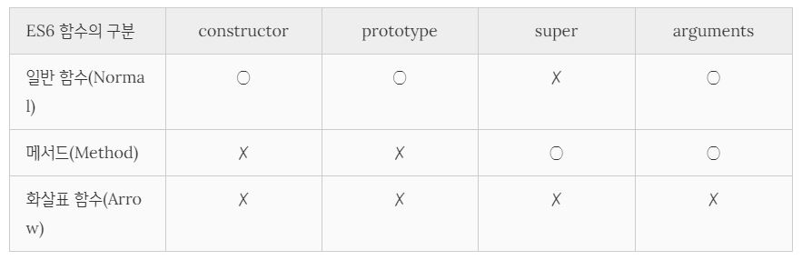

# ES6 함수의 추가 기능

## 함수의 구분

ES6 이전의 모든 함수는 일반 함수로서 호출할 수 있는 것은 물론 생성자 함수로서 호출할 수 있다. 즉, ES6 이전의 모든 함수 객체에는 `[[Call]]`, `[[Constructor]]` 내부 메서드가 모두 존재한다.

이는 곧 생성자 함수로 사용하지 않을 함수도 **`prototype` 프로퍼티를 가지며, 프로토타입 객체를 생성한다** 는 것을 의미한다. 따라서, 이 같은 방식은 **성능** 면에서 문제가 있으며, 생성자 함수로 사용하지 않을 함수도 **문법 상** 으로는 생성자 함수로 **호출 가능** 하다는 문제가 있다.

이를 해결하기 위해 ES6에서는 함수를 사용 목적에 따라 세 가지 + 두 가지(제너레이터, async 함수)로 명확히 구분하였다.



---

## 메서드

ES6 사양에서 메서드는 메서드 축약 표현으로 정의된 함수만을 의미한다. 메서드는 인스턴스를 생성할 수 없는 non-constructor이다. 따라서, 프로토타입 객체를 생성하지 않고 `prototype` 프로퍼티를 가지지도 않는다. 표준 빌드인 객체가 제공하는 프로토타입 메서드와 정적 메서드 또한 모두 non-constructor다.

ES6 메서드는 자신을 바인딩한 객체를 가리키는 내부 슬롯 `[[HomeObject]]`를 갖는다. 이는 곧 `[[HomeObject]]` 내부 슬롯을 참조하여 수퍼클래스를 참조하는 `super` 키워드를 사용할 수 있다는 것을 말한다.

ES6 메서드가 아닌 함수는 `super` 키워드를 사용할 수 없다. ES6 메서드가 아닌 함수는 내부 슬롯 `[[HomeObject]]`를 갖지 않기 때문이다.

---

## 화살표 함수

화살표 함수는 콜백 함수 내부에서 `this`가 전역 객체를 가리키는 문제를 해결하기 위한 대안으로 유용하다.

---

### 화살표 함수 정의

1. 정의

   화살표 함수는 함수 선언문이 아닌 함수 표현식으로 정의해야 한다.

2. 매개변수

   매개변수가 하나인 경우, 소괄호를 생략할 수 있으며 0개나 2개 이상인 경우 소괄호를 생략할 수 없다.

3. 몸체

   함수 몸체가 하나의 문이라면 중괄호를 생략할 수 있고, `return` 키워드를 사용하지 않아도 값으로 평가될 수 있다면 암묵적으로 반환된다.

   중괄호를 생략하였는데 표현식이 아닌 문이라면 에러가 발생한다.

   객체 리터럴을 반환하는 경우 소괄호로 감싸주어야 한다.

   함수 몸체가 하나의 문이 아니라면 중괄호를 생략할 수 없고, `return` 키워드를 사용하여 명시적으로 반환값을 반환하여야 한다.

   화살표 함수 또한 즉시실행함수로 사용할 수 있다.

   ```javascript
   const player = (name, perferredFoot) => ({ name, preferredFoot });
   const thiago = player('thiago', 'right');

   const hyorard = ((name, preferredFoot) => {
     ({ name, preferredFoot });
   })('hyorard', 'right');
   ```

---

### 화살표 함수와 일반 함수의 차이

1. non-constructor이다.
2. 중복된 매개변수 이름을 선언할 수 없다.
3. 함수 자체의 `this`, `arguments`, `super`, `new.target` 바인딩을 갖지 않는다.

   이는 위의 것들을 참조하면 자신의 스코프에서 찾을 수 없기 때문에, 상위 스코프를 참조하게 된다는 것을 의미한다.

---

### this

화살표 함수는 함수 자체의 `this` 바인딩을 갖지 않는다. 따라서 화살표 함수 내부에서 `this`를 참조하면 상위 스코프의 `this`를 그대로 참조한다. 이를 lexical this라 한다.

---

### super

화살표 함수는 함수 자체의 `super` 바인딩을 갖지 않는다. 따라서 화살표 함수 내부에서 `super`를 참조하면 `this`와 마찬가지로 상위 스코프의 `super`를 참조한다.

---

### arguments

화살표 함수는 함수 자체의 `arguments` 바인딩을 갖지 않는다. 따라서 화살표 함수 내부에서 `arguments`를 참조하면 this와 마찬가지로 상위 스코프의 `arguments`를 참조한다. 따라서 화살표 함수로 가변 인자 함수를 구현해야 할 때는 반드시 `Rest` 파라미터를 사용해야 한다.

---

## Rest 파라미터

`Rest` 파라미터(Rest parameter, 나머지 매개변수)는 매개변수 이름 앞에 세개의 점 `…`을 붙여서 정의한 매개변수를 의미한다. `Rest` 파라미터는 함수에 전달된 인수들의 목록을 **배열** 로 전달받는다.

`Rest` 파라미터는 이름 그대로 먼저 선언된 매개변수에 할당된 인수를 제외한 나머지 인수들로 구성된 배열이 할당된다. 따라서 `Rest` 파라미터는 반드시 마지막 파라미터이어야 한다. `Rest` 파라미터가 매개변수 순서의 마지막이 아니라면 `SyntaxError`를 발생시킨다.

`Rest` 파라미터는 함수 정의 시 선언한 매개변수 개수를 나타내는 함수 객체의 `length` 프로퍼티에 영향을 주지 않는다.

```javascript
function foo(...rest) {}
console.log(foo.length); // 0

function bar(x, ...rest) {}
console.log(bar.length); // 1

function baz(x, y, ...rest) {}
console.log(baz.length); // 2
```

---

### arguments VS Rest 파라미터

`arguments` 객체는 배열이 아닌 유사 배열 객체이므로 배열 메서드를 사용하려면 `Function.prototype.call`이나 `Function.prototype.apply` 메서드를 사용해 `arguments` 객체를 배열로 변환해야 하는 번거로움이 있었다.

ES6에서는 `rest` 파라미터를 사용하여 가변 인자 함수의 인수 목록을 배열로 직접 전달받을 수 있다. 이를 통해 유사 배열 객체인 `arguments` 객체를 배열로 변환하는 번거로움을 피할 수 있다.

---

## 매개변수 기본값

매개변수 기본값은 매개변수에 인수를 전달하지 않은 경우와 `undefined`를 전달한 경우에만 유효하다. `Rest` 파라미터에는 기본값을 지정할 수 없다. 매개변수 기본값은 함수 정의 시 선언한 매개변수 개수를 나타내는 함수 객체의` length` 프로퍼티와 `arguments `객체에 아무런 영향을 주지 않는다.
