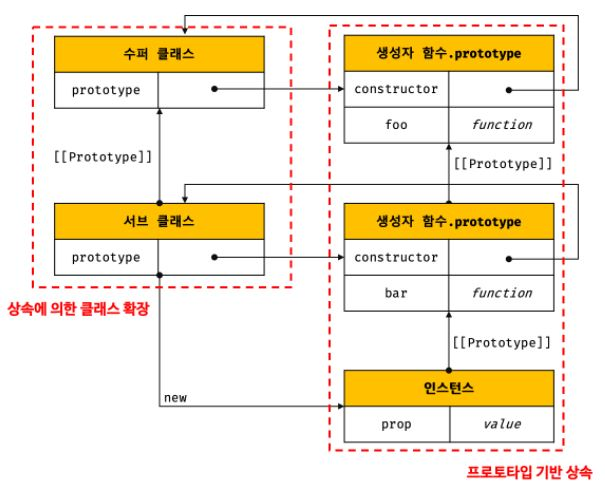

# 클래스

## 클래스 vs 프로토타입

ES5에서는 클래스 없이도 다음과 같이 생성자 함수와 프로토타입을 통해 객체지향 언어의 상속을 구현할 수 있다. 그러나, 기존 클래스 기반 언어에 익숙한 프로그래머를 위해 더욱 빠르게 학습할 수 있도록 ES6에서는 새로운 객체 생성 메커니즘을 제시하였다.

그렇다고 ES6의 클래스가 기존의 프로토타입 기반 객체지향 모델을 폐지하고 새롭게 클래스 기반 객체지향 모델을 제공하는 것은 아니다. 사실 클래스는 함수이며 기존 프로토타입 기반 패턴을 클래스 기반 패턴처럼 사용할 수 있도록 하는 문법적 설탕(syntactic sugar)이라고 볼 수도 있다. 단, 클래스와 생성자 함수는 모두 프로토타입 기반의 인스턴스를 생성하지만 정확히 동일하게 동작하지는 않는다. 클래스는 생성자 함수보다 엄격하며 생성자 함수에서는 제공하지 않는 기능도 제공한다.

클래스와 생성자 함수의 차이점은 다음과 같다.

1. 클래스는 `new` 연산자 없이 호출할 수 없다. `new` 연산자 없이 호출할 경우 에러가 발생한다.

2. 클래스는 상속을 지원하는 `extends`, `super` 키워드를 제공한다.

3. 클래스는 호이스팅이 발생하지 않는 것처럼 동작한다.

4. 클래스 내의 모든 코드에는 암묵적으로 `strict mode`가 지정되어 해제할 수 없다.

5. 클래스의 `constructor`, 프로토타입 메서드, 정적 메서드는 모두 프로퍼티 어트리뷰트 `[[Enumberable]]`의 값이 `false`이기 때문에 열거되지 않는다.

클래스는 생성자 함수 기반의 객체 생성 방식보다 견고하고 명료하다.

---

## 클래스 정의

클래스는 일급 객체이기 때문에 다음과 같은 특징을 갖는다.

- 무명의 리터럴로 생성할 수 있어 런타임에 생성할 수 있다.
- 변수나 자료구조에 저장할 수 있다.
- 함수의 매개변수로 전달할 수 있다.
- 함수의 반환값으로 사용할 수 있다.

엄밀히 클래스는 함수이기 때문에, 일급 객체인 것이다.

클래스 몸체에서 정의할 수 있는 메서드는 `constructor`, 프로토타입 메서드, 정적 메서드 세 가지이다.

```javascript
class Player {
  // 생성자
  constructor(name) {
    this.name = name;
  }

  // 프로토타입 메서드
  sayHi() {
    console.log(`my name is ${this.name}`);
  }

  // 정적 메서드
  static sayHello() {
    console.log(`Hello!`);
  }
}

const thiago = new Player('thiago');
console.log(thiago.name);
thiago.sayHi();
Player.sayHello();
```

## 클래스 호이스팅

클래스 선언문으로 정의한 클래스는 함수 선언문과 같이 소스코드 평가 과정, 즉 런타임 이전에 먼저 평가되어 함수 객체를 생성한다. 이때 클래스가 평가되어 생성된 함수 객체는 생성자 함수로서 호출할 수 있는 함수, 즉 `constructor`다. 단, 클래스는 클래스 정의 이전에 참조할 수 없다. 호이스팅이 일어나지 않는 것처럼 보이지만, 호이스팅은 일어나며 `let`, `const` 키워드와 선언한 변수와 같이 TDZ가 있을 뿐이다.

```javascript
console.log(Player); // ReferenceError

class Player {}
```

```javascript
const Player = '';

{
  // 호이스팅이 일어나지 않는다면 ''가 출력되어야 한다.
  console.log(Player); // ReferenceError

  class Player {}
}
```

---

## 인스턴스 생성

클래스는 인스턴스를 생성하는 것이 유일한 존재 이유이므로 반드시 `new` 연산자와 함께 호출해야 한다. `new` 연산자와 함께 호출하지 않는다면 다음과 같은 에러가 발생한다.

`TypeError: Class constructor Foo cannot be invoked without 'new'`

또한, 기명 클래스 표현식으로 클래스를 정의할 경우 클래스 이름으로 `new` 연산자와 함께 호출하면 에러가 발생한다. 기명 함수 표현식과 마찬가지로 클래스 이름은 외부 코드에서 접근할 수 없기 때문이다.

```javascript
const Player = class Playerr {};

const thiago = new Player();

console.log(Playerr); // ReferenceError: Playerr is not defined

const hyorard = new Playerr(); // ReferenceError: Playerr is not defined
```

---

## 메서드

클래스 몸체에는 0개 이상의 메서드만 선언할 수 있어, 프로퍼티를 직접 정의할 수는 없다. 그러나 클래스 몸체에 프로퍼티를 직접 정의할 수 있는 새로운 표준 사양이 제안되어 있긴 하다.

### constructor

`constructor`는 인스턴스를 생성하고 초기화하기 위한 특수한 메서드다. `constructor`는 이름을 변경할 수 없다. `constructor`는 생략 가능하며 클래스 당 2개 이상을 가질 수 없다. 생략할 경우 암묵적으로 빈 `constructor`가 정의된다.

모든 함수 객체가 가지고 있는 `prototype` 프로퍼티가 가리키는 프로토타입 객체의 `constructor` 프로퍼티는 클래스 자신을 가리키고 있다. 이는 클래스가 인스턴스를 생성하는 생성자 함수라는 것을 의미한다. 즉, `new` 연산자와 함께 클래스를 호출하면 클래스는 인스턴스를 생성한다.

생성자 함수와 마찬가지로 `constructor` 내부에서 `this`에 추가한 프로퍼티는 인스턴스 프로퍼티가 된다. `constructor` 내부의 `this`는 생성자 함수와 마찬가지로 클래스가 생성한 인스턴스를 가리킨다.

클래스 내부에 정의한 `constructor` 메서드는 클래스가 평가되어 생성된 함수 객체나 생성된 인스턴스를 출력해봐도 어디에도 없다. 이는 `constuctor`가 메서드로 해석되는 것이 아니라 클래스가 평가되어 생성한 함수 객체 코드의 일부가 되는데, 클래스 정의가 평가되면 `constructor`의 기술된 동작을 하는 함수 객체가 생성된다.

`constructor`는 별도의 반환문을 갖지 않아야 한다. 암묵적으로 생성한 인스턴스를 반환하기 때문이다. 생성자 함수와 같이 다른 객체를 명시적으로 반환하면 생성한 인스턴스가 아닌 명시한 객체가 반환된다.

---

### 프로토타입 메서드

클래스 몸체에서 정의한 메서드는 생성자 함수에 의한 객체 생성 방식과는 다르게 클래스의 `prototype` 프로퍼티에 메서드를 추가하지 않아도 기본적으로 프로토타입 메서드가 된다.

---

### 정적 메서드

정적 메서드는 클래스를 정의할 때, `static` 키워드를 사용하여 정의할 수 있다. 클래스는 함수 객체로 평가되므로 자신의 프로퍼티/메서드를 소유할 수 있다. 클래스는 클래스 정의(클래스 선언문이나 클래스 표현식)가 평가되는 시점에 함수 객체가 되므로 인스턴스와 달리 별다른 생성 과정이 필요 없다. 따라서 정적 메서드는 클래스 정의 이후 인스턴스를 생성하지 않아도 호출할 수 있다.

---

### 정적 메서드와 프로토타입 메서드의 차이

정적 메서드와 프로토타입 메서드의 차이는 다음과 같다.

1. 정적 메서드와 프로토타입 메서드는 자신이 속해있는 프로토타입 체인이 다르다.
2. 정적 메서드는 클래스로 호출하고 프로토타입 메서드는 인스턴스로 호출한다.
3. 정적 메서드는 인스턴스 프로퍼티를 참조할 수 없지만 프로토타입 메서드는 인스턴스 프로퍼티를 참조할 수 있다.

정적 메서드는 클래스 또는 생성자 함수를 하나의 네임 스페이스로 사용하여 모아 놓으면, 이름 충돌 가능성을 줄이고 관련 함수들을 구조화할 수 있는 효과가 있다.

---

### 클래스에서 정의한 메서드의 특징

클래스에서 정의한 메서드의 특징은 다음과 같다.

1. `function` 키워드를 생략한 메서드 축약 표현을 사용한다.
2. 객체 리터럴과는 다르게 클래스에 메서드를 정의할 때에는 콤마가 필요 없다.
3. 암묵적으로 strict mode로 실행된다.
4. `for...in` 문이나 `Object.keys` 메서드 등으로 열거할 수 없다.
5. 내부 메서드 `[[Construct]]`를 갖지 않는 non-constructor이다.

---

## 클래스의 인스턴스 생성 과정

1. 인스턴스 생성과 `this` 바인딩

   먼저, 암묵적으로 빈 객체를 생성하고, 클래스가 생성한 인스턴스의 프로토타입으로 클래스의 `prototype`이 가리키는 객체가 설정된다. 그리고 생성한 빈 객체에 `this`가 바인딩된다.

2. 인스턴스 초기화

   `constructor`의 내부 코드가 실행되어 `this`에 바인딩되어 있는 인스턴스를 초기화한다. 만약 `constructor`가 생략되었다면 이 과정도 생략된다.

3. 인스턴스 반환

   클래스의 모든 처리가 끝나면 완성된 인스턴스가 바인딩된 `this`가 암묵적으로 반환된다.

---

## 프로퍼티

### 인스턴스 프로퍼티

인스턴스 프로퍼티는 `constructor` 내부에서 정의해야 한다. 인스턴스의 프로퍼티는 언제나 public하다.

---

### 접근자 프로퍼티

접근자 프로퍼티는 자체적으로 `[[Value]]` 내부 슬롯을 가지지 않고, 다른 데이터 프로퍼티의 값을 읽거나 저장할 때 사용되는 접근자 함수로 구성된 프로퍼티이다.

```javascript
class Player {
  constructor(name, preferredFoot) {
    this.name = name;
    this.preferredFoot = preferredFoot;
  }

  get playerInfo() {
    return `${this.name}'s preferred foot is ${this.preferredFoot}`;
  }

  set playerInfo(info) {
    [this.name, this.preferredFoot] = info.split(' ');
  }
}

const thiago = new Player('thiago', 'right');

console.log(thiago.playerInfo);
thiago.playerInfo = 'hyorard right';
console.log(thiago.playerInfo);
```

접근자 프로퍼티는 자체적으로는 값을 갖지 않고 다른 데이터 프로퍼티의 값을 읽거나 저장할 때 사용하는 접근자 함수(accessor function), 즉 `getter` 함수와 `setter` 함수로 구성되어 있다.

이때 `getter`와 `setter` 이름은 인스턴스 프로퍼티처럼 사용된다. 다시 말해 `gette`r는 호출하는 것이 아니라 프로퍼티처럼 참조하는 형식으로 사용하며, 참조 시에 내부적으로 `getter`가 호출된다. `setter`도 호출하는 것이 아니라 프로퍼티처럼 값을 할당하는 형식으로 사용하며, 할당 시에 내부적으로 `setter`가 호출된다.

`getter`는 이름 그대로 무언가를 취득할 때 사용하므로 반드시 무언가를 반환해야 하고 `setter`는 무언가를 프로퍼티에 할당해야 할 때 사용하므로 반드시 매개변수가 있어야 한다. `setter`는 단 하나의 값만 할당받기 때문에 단 하나의 매개변수만 선언할 수 있다.

---

### 클래스 필드 정의 제안

클래스 몸체에서 클래스 필드를 정의할 수 있는 클래스 필드 정의(Class field definitions) 제안은 아직 ECMAScript의 정식 표준 사양으로 승급되지 않았다. 하지만 최신 브라우저(Chrome 72 이상)와 최신 Node.js(버전 12 이상)는 표준 사양으로 승급이 확실시되는 이 제안을 선제적으로 미리 구현해 놓았다. 따라서 최신 브라우저와 최신 Node.js에서는 다음 예제와 같이 클래스 필드를 클래스 몸체에 정의할 수 있다.

this, 즉 클래스가 생성한 인스턴스에 클래스 필드에 해당하는 프로퍼티가 없다면 자동 추가되기 때문에 클래스 필드에 정의한 프로퍼티와 메서드는 모두 인스턴스 프로퍼티, 메서드가 된다.

```javascript
class Person {
  job = 'athlete';
  // this.job = 'athlete'; SyntaxError
  height; // 초기화하지 않으면 undefined

  // 클래스 필드에 함수를 정의하면 인스턴스 메서드가 된다.
  sayHi = function () {
    console.log(`${this.name} is ${this.job}`);
  };

  constructor(name) {
    this.name = name;
    console.log(this.job);
    // console.log(job); ReferenceError
  }
}

const thiago = new Person('thiago');
console.log(thiago); // Person {job: 'athlete',height: undefined,sayHi: [Function: sayHi],name: 'thiago }
console.log(thiago.job); // athlete
```

---

### private 필드 정의 제안

클래스 필드나, `constructor` 안에 정의하는 인스턴스 프로퍼티는 모두 public하다. 현재 TC39 프로세스의 stage 3(candidate)에는 `private` 필드를 정의할 수 있는 새로운 표준 사양이 제안되어 있다. 표준 사양으로 승급이 확실시 되는 이 제안도 최신 브라우저(Chrome 74 이상)와 최신 Node.js(버전 12 이상)에 이미 구현되어 있다.

`private` 필드의 선두에는 `#`을 붙이고, 참조할 때 또한 `#`을 붙여주어야 한다.

```javascript
class Player {
  #name = '';

  constructor(name) {
    this.#name = name;
    // this.#job = job; private 필드를 constructor 내부에서 직접 정의하면 에러
  }

  get name() {
    return this.#name;
  }
}

const thiago = new Player('thiago');

console.log(thiago.name);

console.log(thiago.#name); // SyntaxError: Private field '#name' nust be declared in an enclosing class
```


`private` 필드는 클래스 내부에서만 접근할 수 있다. 다만 접근자 프로퍼티를 통해 간접적으로 접근하는 방법은 유효하다.

---

### static 필드 정의 제안

클래스에는 `static` 키워드를 사용하여 정적 메서드를 정의할 수 있다. 하지만 `static `키워드를 사용하여 정적 필드를 정의할 수는 없었다. 하지만 `static public` 필드, `static private 필드`, `static private` 메서드를 정의할 수 있는 새로운 표준 사양인 “Static class features”이 2020년 7월 현재, TC39 프로세스의 stage 3(candidate)에 제안되어 있다. 이 제안 중에서 static public/private 필드는 2020년 7월 현재, 최신 브라우저(Chrome 72 이상)와 최신 Node.js(버전 12 이상)에 이미 구현되어 있다.

---

## 상속에 의한 클래스 확장

프로토타입 기반 상속은 프로토타입 체인을 통해 다른 객체의 자산을 상속받는 개념이지만 상속에 의한 클래스 확장은 기존 클래스를 상속받아 새로운 클래스를 확장(extends)하여 정의하는 것이다. 클래스는 상속을 통해 다른 클래스를 확장할 수 있는 문법인 `extends` 키워드가 기본적으로 제공된다.



---

### extends 키워드

상속을 통해 확장된 클래스를 서브클래스(subclass)라 부르고, 서브클래스에게 상속된 클래스를 수퍼클래스(superclass)라 부른다. 서브클래스를 파생 클래스(derived class) 또는 자식 클래스(child class), 수퍼클래스를 베이스 클래스(base class) 또는 부모 클래스(parent class)라고 부르기도 한다.

수퍼클래스와 서브클래스는 인스턴스의 프로토타입 체인 뿐만이 아니라, 클래스 간의 프로토타입 체인도 생성한다. 이를 통해 프로토타입 메서드, 정적 메서드 모두 상속이 가능하다.

---

### 동적 상속

`extends` 키워드는 클래스뿐만 아니라 생성자 함수를 상속받아 클래스를 확장할 수도 있다. 단, `extends` 키워드 앞에는 반드시 클래스가 와야 한다. `extends` 키워드 다음에는 클래스뿐만이 아니라 `[[Construct]]` 내부 메서드를 갖는 함수 객체로 평가될 수 있는 모든 표현식을 사용할 수 있다. 이를 통해 동적으로 상속받을 대상을 결정할 수 있다.

---

### 서브클래스의 constructor

서브클래스에서 `constructor`를 생략하면 클래스에 다음과 같은 `constructor`가 암묵적으로 정의된다. `args`는 `new` 연산자와 함께 클래스를 호출할 때 전달한 인수의 리스트다.

`constructor(...args) { super(...args); }`

`super()`는 수퍼클래스의 constructor(super-constructor)를 호출하여 인스턴스를 생성한다.

---

### super 키워드

`super` 키워드는 함수처럼 호출할 수도 있고 `this`와 같이 식별자처럼 참조할 수 있는 특수한 키워드다. `super`는 다음과 같이 동작한다.

- `super`를 호출하면 수퍼클래스의 constructor를 호출한다.
- `super`를 참조하면 수퍼클래스의 메서드를 호출할 수 있다.

수퍼클래스에서 추가한 프로퍼티와 서브클래스에서 추가한 프로퍼티를 갖는 인스턴스를 생성한다면 서브클래스의 `constructor`를 생략할 수 없다.

```javascript
class Base {
  constructor(a, b) {
    this.a = a;
    this.b = b;
  }
}

class Derived extends Base {
  constructor(a, b, c) {
    super(a, b);
    this.c = c;
  }
}

const derived = new Derived(1, 2, 3);
console.log(derived);
```

`super`를 호출할 때 주의할 사항은 다음과 같다.

1. 서브 클래스에서 `constructor`를 생략하지 않는 경우 서브클래스의 `constructor`에서는 반드시 `super`를 호출해야 한다.
2. 서브 클래스의 `constructor`에서 `super`를 호출하기 전에는 `this`를 참조할 수 없다.
3. `super`는 반드시 서브클래스의 `constuctor`에서만 호출한다. 서브클래스가 아닌 클래스의 `constructor`나 함수에서 `super`를 호출하면 에러가 발생한다.

메서드 내에서 `super`를 참조하면 수퍼클래스의 메서드를 호출할 수 있다.

1. 서브클래스 메서드의 `super`는 자신을 참조하고 있는 메서드가 바인딩되어 있는 객체의 프로토타입을 가리킨다.

   이를 위해서는 `super`가 `super`를 참조하고 있는 메서드가 바인딩되어 있는 객체의 프로토타입을 찾을 수 있어야 하는데, 이를 위해 메서드는 내부 슬롯 `[[HomeObject]]`를 가지며, 자신을 바인딩하고 있는 객체를 가리킨다.

   주의할 것은 ES6의 메서드 축약 표현으로 정의된 함수만이 `[[HomeObject]]`를 갖는다는 것이다. `[[HomeObject]]`를 가지는 함수만이 `super` 참조를 할 수 있다.

2. 서브 클래스의 정적 메서드 내에서 `super.sayHi`는 수퍼클래스의 정적 메서드 `sayHi`를 가리킨다.

---

### 상속 클래스의 인스턴스 생성 과정

1. 서브클래스의 `super` 호출

   클래스를 평가할 때 수퍼클래스와 서브클래스를 구분하기 위해 "base" 또는 "derived"를 값으로 갖는 내부 슬롯 `[[ConstructorKind]]`를 갖는다. 상속받지 않는 클래스는 "base"를, 다른 클래스를 상속받는 서브클래스는 "derived" 값을 가진다. 이를 통해 수퍼클래스와 서브클래스는 `new` 연산자와 호출되었을 때 동작이 달라진다. 서브클래스는 `new` 연산자와 함께 호출되었을 때, 자신이 직접 인스턴스를 생성하지 않고 수퍼클래스에게 인스턴스 생성을 위임한다.

2. 수퍼클래스의 인스턴스 생성과 `this` 바인딩

   수퍼클래스의 `constructor` 내부의 코드가 실행되기 이전에 암묵적으로 빈 객체를 생성한다. 하지만 `new` 연산자와 함꼐 호출된 클래스가 서브클래스이기 때문에, `new.target`은 서브클래스를 가리킨다. 따라서 인스턴스는 `new.target`이 가리키는 서브클래스가 생성한 것으로 처리된다. 따라서 생성된 인스턴스의 프로토타입은 수퍼클래스의 `prototype` 프로퍼티가 가리키는 객체가 아니라 서브 클래스의 `prototype` 프로퍼티가 가리키는 객체이다.

3. 수퍼클래스의 인스턴스 초기화

   수퍼 클래스의 `constructor`가 실행되어 `this`가 바인딩되어 있는 인스턴스를 초기화한다.

4. 서브클래스 `constructor`로 복귀와 `this` 바인딩

   제어 흐름이 서브 클래스 `constructor`로 돌아오면 `super`가 반환한 인스턴스가 `this`에 바인딩된다.

5. 서브클래스의 인스턴스 초기화
6. 인스턴스 반환

---

### 표준 빌트인 생성자 함수 확장

`extends` 키워드 다음에는 클래스뿐만이 아니라 `[[Construct]]` 내부 메서드를 갖는 함수 객체로 평가될 수 있는 모든 표현식을 사용할 수 있다. `String`, `Number`, `Array`와 같은 표준 빌트인 객체도 `[[Construct]]` 내부 메서드를 갖는 생성자 함수이므로 `extends` 키워드를 사용하여 확장할 수 있다.
