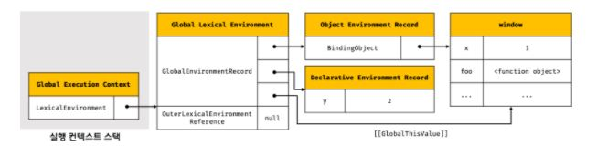
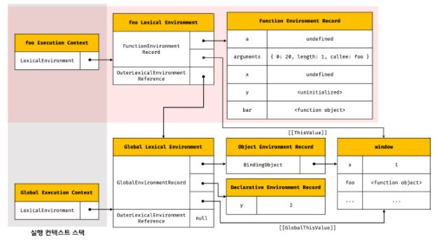
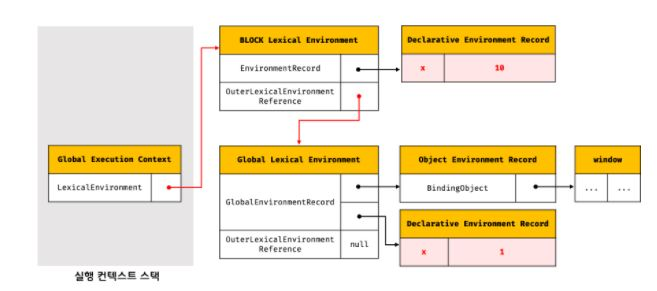

# 실행 컨텍스트

## 소스 코드의 타입

1. 전역 코드

   전역에 존재하는 소스코드로 전역 변수, 전역 함수 등의 코드로 평가되면 전역 실행 컨텍스트가 생성된다.

2. 함수 코드

   평가되면 함수 실행 컨텍스트를 생성하고 지역 스코프를 생성하며, 스코프 체인에 연결한다.

3. eval 코드
4. 모듈 코드

---

## 소스코드의 평가와 실행

자바스크립트 엔진은 소스코드를 2개의 과정, 즉 **소스코드의 평가** 와 **소스코드의 실행** 과정으로 나누어 처리한다.

1. 소스코드 평가 과정

   런타임 전, 실행 컨텍스트를 생성한 후 변수와 함수 등의 선언문 만을 먼저 실행하여 생성된 식별자를 키로 실행 컨텍스트가 관리하는 스코프에 등록한다.

2. 소스코드 실행 과정

   런타임이 시작되어 소스코드가 순차적으로 실행되기 시작한다.

---

## 실행 컨텍스트의 역할

코드가 실행되려면 스코프를 구분하여 식별자와 바인딩된 값이 관리되어야 한다. 그리고 중첩 관계에 의해 스코프 체인을 형성하여 식별자를 검색할 수 있어야 하고, 전역 객체의 프로퍼티도 전역 변수처럼 검색할 수 있어야 한다. 또한 함수 호출이 종료되면 함수 호출 이전으로 되돌아가기 위해 현재 실행 중인 코드와 이전에 실행하던 코드를 구분하여 관리해야 한다.

즉, 코드를 실행하기 위해서는 **스코프**, **코드 실행 순서** 등을 관리해야 한다. 이를 실행 컨텍스트가 관리하는데, 실행 컨텍스트란 식별자를 관리하는 스코프와 코드 실행 순서 관리를 구현한 내부 매커니즘이다.

실행 컨텍스트는 다음 2가지로 구성된다.

1. 실행 컨텍스트 스택 - 코드 실행 순서 관리
2. 렉시컬 환경 - 식별자 및 스코프 관리

---

## 실행 컨텍스트 스택

런타임 전, 전역 코드를 평가하여 전역 실행 컨텍스트를 생성하고, 런타임에 전역 코드를 실행하다가 함수가 호출되면 런타임을 멈추고 함수코드를 평가하여 함수 실행 컨텍스트를 생성한 후, 런타임에 함수 코드를 실행한다. 이때 생성된 실행 컨텍스트는 스택을 이용해 관리하고 이를 실행 컨텍스트 스택이라 한다.

실행 컨텍스트 스택은 **코드의 실행 순서를 관리** 하는데, 스택의 최상위 실행 컨텍스트는 언제나 현재 실행 중인 코드의 실행 컨텍스트이고, 이를 **실행 중인 실행 컨텍스트** 라고 한다.

--

## 렉시컬 환경

렉시컬 환경은 스코프를 구분하여 식별자를 등록하고 관리하는 저장소 역할을 하는 렉시컬 스코프의 실체다.

렉시컬 환경은 다음 두 가지로 구성된다.

1. 환경 레코드 (Environment Record)

   스코프에 포함된 식별자를 등록하고 바인딩된 바인딩 값을 관리한다.

2. 외부 렉시컬 환경에 대한 참조(Outer Lexical Environment Reference)

   스코프 체인을 위한 상위 스코프 즉, 해당 실행 컨텍스트를 생성한 소스코드를 포함하는 렉시컬 환경이며, 외부 렉시컬 환경에 대한 참조를 통해 스코프 체인을 구현한다.

---

## 실행 컨텍스트의 생성과 식별자 검색 과정

1. 전역 객체 생성 및 프로퍼티 초기화, 할당

   전역 객체도 `Object.prototype`을 상속받는다.

2. 전역 코드 평가

   소스코드가 로드되면 전역 코드를 평가하여 다음과 같은 실행 컨텍스트와 렉시컬 환경을 생성한다.

   

   ```
   1. 전역 실행 컨텍스트 생성
   2. 전역 렉시컬 환경 생성

       전역 렉시컬 환경이 전역 실행 컨텍스트 안에 들어가 있음

       2-1. 전역 환경 레코드 생성


           2-1-1. 객체 환경 레코드 생성

               전 단계에서 생성한 전역 객체인 BindingObject의 주소값을 가지게 된다. 전역 변수와 함수, 빌트인 전역 프로퍼티와 함수, 표준 빌트인 객체들이 들어있는데, 이 중 전역 변수와 함수와 같이 소스코드에 포함된 식별자들을 지금 BindingObject의 프로퍼티 키로 할당하고, undefined로 프로퍼티 값으로 초기화하게 된다.

           2-1-2. 선언적 환경 레코드 생성

               const, let 키워드로 생성한 전역 변수가 들어있다.

       2-2. this 바인딩

           전역 환경 레코드의 [[GlobalThisValue]] 내부 슬롯은 전역 객체의 참조값과 바인딩된다. 전역 코드에서 this를 참조하면, 전역 환경 레코드의 [[GlobalThisValue]] 참조값이 반환되는데 이것이 전역 객체인 것이다.

       2-3. 외부 렉시컬 환경에 대한 참조 결정

           해당 코드를 포함한 코드의 렉시컬 환경을 참조하는데, 전역 코드를 포함하는 코드는 없으므로 null이 할당된다.

   ```

3. 전역 코드 실행

   식별자는 다른 스코프라면 동일한 이름을 가질 수 있고, 이로 인해 어느 스코프의 식별자를 참조할 것인지 결정해야 하는데, 이를 식별자 결정이라 한다.

   식별자 결정은 현재 실행중인 실행 컨텍스트의 렉시컬 환경에서 찾고, 만약 찾을 수 없다면 외부 렉시컬 환경에 대한 참조를 통해 상위 스코프에서 식별자를 검색하게 된다.

4. 함수 코드 평가

   함수가 호출되면 런타임을 중단하고, 함수를 평가한다. 다음은 함수를 평가한 후 생성된 실행 컨텍스트와 렉시컬 환경이다.

   

   ```

   1. 함수 실행 컨텍스트 생성

       함수 실행 컨텍스트를 생성 및 스택에 푸시한다.

   2. 함수 렉시컬 환경 생성
       2-1. 함수 환경 레코드 생성

           매개변수, arguments 객체, 함수 내부의 지역 변수와 중첩 함수를 관리한다.

       2-2. this 바인딩

           함수 환경 레코드의 [[ThisValue]] 내부 슬롯에 호출 방식에 따른 this가 바인딩된다.

       2-3. 외부 렉시컬 환경에 대한 참조 결정

           함수 정의가 평가된 시점의 실행 중인 실행 컨텍스트의 렉시컬 환경의 참조가 할당된다. 이것이 자바스크립트가 정적 스코프를 가지게 되는 원인이다. 함수가 어디서 호출되는 지가 아니라 어디서 정의되는 지에 따라 상위 스코프가 바뀌는데, 이는 바로 외부 렉시컬 환경에 대한 참조가 함수를 정의하는 시점에 결정되기 때문이다.

           정확히 말하면 결정은 함수 정의를 평가하고 함수 객체의 [[Environment]] 내부 슬롯에 현재 실행 중인 실행 컨텍스트의 렉시컬 환경의 참조값을 할당할 때 결정 되는 것이고, 함수 렉시컬 환경의 외부 렉시컬 환경에 대한 참조는 함수가 호출될 때 함수 객체의 [[Environment]] 내부 슬롯의 값을 가지게 되는 것이다.

   ```

5. 함수 코드 실행

   매개변수에 인수가 할당되고, 할당문들의 실행, 함수 호출 등이 일어난다.

6. 중첩 함수 코드 평가
7. 중첩 함수 코드 실행

   `console.log(a+b+x+y+z)` 를 예로 들자면, `console` 식별자를 렉시컬 환경 -> 외부 렉시컬 환경에 대한 참조 -> ... -> 종점 에 이르는 스코프 체인에서 찾기 시작하고, 전역 렉시컬 환경의 환경 레코드 중 객체 환경 레코드의 BindingObject에서 찾게 된다. `log` 메서드를 찾은 `console` 객체의 프로토타입 체인에서 검색하고, 찾게 되면 인수들을 다시 스코프 체인에서 각각 찾은 다음 값을 평가하여 `log` 메서드에 전달하여 호출하게 된다.

8. 중첩 함수 코드 실행 종료

   실행 컨텍스트 스택에서 중첩 함수 실행 컨텍스트가 pop된다. 여기서 실행 컨텍스트의 렉시컬 환경도 같이 소멸하는 것은 아니며, 렉시컬 환경을 아무도 참조하지 않을 때 garbage collecting 되어 소멸하게 된다.

9. 함수 코드 실행 종료
10. 전역 코드 실행 종료

    전역 실행 컨텍스트도 pop되어 스택에 아무것도 남아있지 않게 된다.

---

## 실행 컨텍스트와 블록 레벨 스코프

1. if 블록문

   

   `const`나 `let` 키워드를 통해 변수가 선언되면 블록 레벨 스코프를 생성해야 하기 때문에, 새로운 렉시컬 환경을 생성하고, 실행 컨텍스트의 렉시컬 환경이 생성한 환경을 참조하게 한다. 그리고 생성한 렉시컬 환경의 외부 렉시컬 환경에 대한 참조를 기존 렉시컬 환경을 참조하게 한다.

2. for 블록문

   `if` 블록문과 같지만, 코드 블록이 반복해서 실행될 때마다 코드 블록을 위한 새로운 렉시컬 환경을 생성한다.

기타 블록문 또한 동일하게 동작한다.
