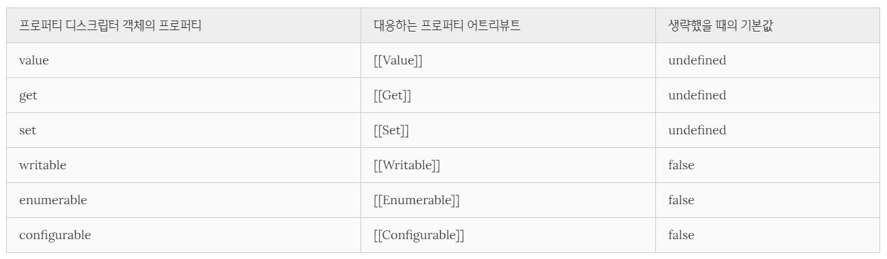
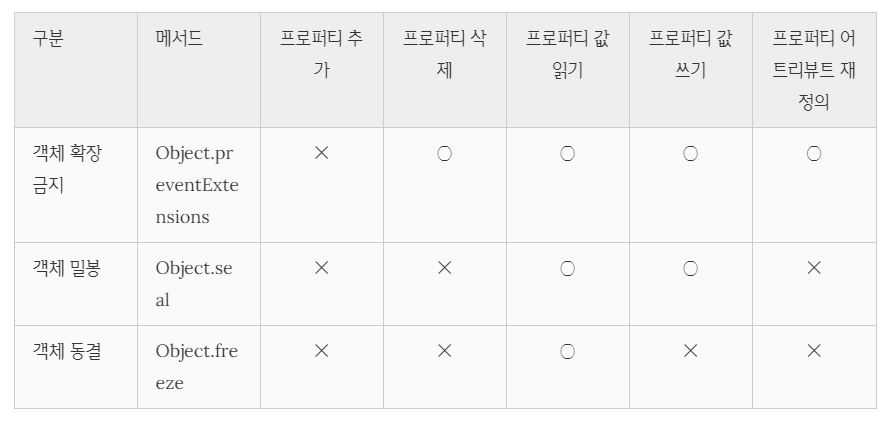

# let, const와 블록 레벨 스코프

## var 키워드로 선언한 변수의 문제점

### 변수 중복 선언 허용

`var` 키워드의 문제점은 `var` 키워드로 선언한 동일한 이름의 변수가 이미 선언되어 있는 것을 모르고 변수를 중복 선언하면서 값까지 할당했다면 의도치 않게 먼저 선언된 변수 값이 변경되는 부작용이 발생한다.

---

### 함수 레벨 스코프

`var` 키워드로 선언한 변수는 함수 레벨 스코프만을 지원한다. 따라서, `if`, `for` 문과 같은 블록문 내에서 `var` 키워드로 선언한 변수는 전역 변수가 되고, 의도치 않은 동작 또는 에러를 발생시킬 수 있는 가능성이 생긴다.

---

### 변수 호이스팅

`var` 키워드로 선언한 변수는 호이스팅되어 선언하기 전에 참조할 수 있게 된다. 변수 선언문 이전에 변수를 참조하는 것은 변수 호이스팅에 의해 에러를 발생시키지는 않지만 프로그램의 흐름상 맞지 않을뿐더러 가독성을 떨어뜨리고 오류를 발생시킬 여지를 남긴다.

---

## let 키워드

### 변수 중복 선언 금지

let 키워드로 이름이 같은 변수를 중복 선언하면 문법 에러(SyntaxError)가 발생한다.

---

### 블록 레벨 스코프

let 키워드로 선언한 변수는 모든 코드 블록(함수, if 문, for 문, while 문, try/catch 문 등)을 지역 스코프로 인정하는 블록 레벨 스코프(block-level scope)를 따른다.

```javascript
let i = 10;

function foo() {
  let i = 100;

  for (let i = 0; i < 3; i++) {
    console.log(i); // 0 1 2
  }

  console.log(i); // 100
}

foo();
console.log(i); // 10
```

---

### 변수 호이스팅

`var` 키워드로 선언한 변수는 런타임 이전에 자바스크립트 엔진에 의해 암묵적으로 “선언 단계”와 “초기화 단계”가 한번에 진행된다.

즉, 선언 단계에서 스코프(실행 컨텍스트의 렉시컬 환경(Lexical Environment))에 변수 식별자를 등록해 자바스크립트 엔진에 변수의 존재를 알린다. 그리고 즉시 초기화 단계에서 `undefined`로 변수를 초기화한다. 따라서 변수 선언문 이전에 변수에 접근해도 스코프에 변수가 존재하기 때문에 에러가 발생하지 않는다. 다만 `undefined`를 반환한다. 이후 변수 할당문에 도달하면 비로소 값이 할당된다.

`let` 키워드로 선언한 변수는 “선언 단계”와 “초기화 단계”가 분리되어 진행된다. 즉, 런타임 이전에 자바스크립트 엔진에 의해 암묵적으로 선언 단계가 먼저 실행되지만 초기화 단계는 변수 선언문에 도달했을 때 실행된다.

만약 초기화 단계가 실행되기 이전에 변수에 접근하려고 하면 참조 에러(ReferenceError)가 발생한다. `let` 키워드로 선언한 변수는 스코프의 시작 지점부터 초기화 단계 시작 지점(변수 선언문)까지 변수를 참조할 수 없다. 스코프의 시작 지점부터 초기화 시작 지점까지 변수를 참조할 수 없는 구간을 일시적 사각지대(Temporal Dead Zone; TDZ)라고 부른다.

자바스크립트는 ES6에서 도입된 `let`, `const`를 포함해서 모든 선언(`var`, `let`, `const`, `function`, `function*`, `class` 등)을 호이스팅한다. 단, ES6에서 도입된 `let`, `const`, `class`를 사용한 선언문은 호이스팅이 발생하지 않는 것처럼 동작한다.

---

### 전역 객체와 let

`var` 키워드로 선언한 전역 변수와 전역 함수, 그리고 선언하지 않은 변수에 값을 할당한 암묵적 전역은 전역 객체 `window`의 프로퍼티가 된다. 전역 객체의 프로퍼티를 참조할 때 `window`를 생략할 수 있다.

```javascript
// 이 예제는 브라우저 환경에서 실행해야 한다.

// 전역 변수
var x = 1;
// 암묵적 전역
y = 2;
// 전역 함수
function foo() {}

// var 키워드로 선언한 전역 변수는 전역 객체 window의 프로퍼티다.
console.log(window.x); // 1
// 전역 객체 window의 프로퍼티는 전역 변수처럼 사용할 수 있다.
console.log(x); // 1

// 암묵적 전역은 전역 객체 window의 프로퍼티다.
console.log(window.y); // 2
console.log(y); // 2

// 함수 선언문으로 정의한 전역 함수는 전역 객체 window의 프로퍼티다.
console.log(window.foo); // ƒ foo() {}
// 전역 객체 window의 프로퍼티는 전역 변수처럼 사용할 수 있다.
console.log(foo); // ƒ foo() {}
```

`let` 키워드로 선언한 변수는 전역 객체 `window`의 프로퍼티가 되는 것이 아니라, 전역 렉시컬 환경의 선언적 환경 레코드(보이지 않는 개념적인 블록)내에 존재하게 되어 `window`로 접근할 수 없다.

```javascript
// 이 예제는 브라우저 환경에서 실행해야 한다.
let x = 1;

// let, const 키워드로 선언한 전역 변수는 전역 객체 window의 프로퍼티가 아니다.
console.log(window.x); // undefined
console.log(x); // 1
```

---

## const 키워드

### 선언과 초기화

`const` 키워드로 선언한 변수는 반드시 선언과 동시에 초기화해야 한다. `const` 키워드로 선언한 변수는 `let` 키워드로 선언한 변수와 마찬가지로 블록 레벨 스코프를 가지며, 변수 호이스팅이 발생하지 않는 것처럼 동작한다.

---

### 재할당 금지

`const` 키워드로 선언한 변수는 재할당이 금지된다.

---

### 상수

`const` 키워드로 선언된 변수에 원시값을 할당한 경우, 원시값은 변경할 수 없는 값(immutable value)이고 `const` 키워드에 의해 재할당이 금지되므로 할당된 값을 변경할 수 있는 방법은 없다.

일반적으로 상수의 이름은 대문자로 선언해 상수임을 명확히 나타낸다. 여러 단어로 이뤄진 경우에는 언더스코어(\_)로 구분해서 스네이크 케이스로 표현하는 것이 일반적이다.

---

### const 키워드와 객체

`const` 키워드로 선언된 변수에 원시값을 할당한 경우 값을 변경할 수 없다. 하지만 const 키워드로 선언된 변수에 객체를 할당한 경우, 값을 변경할 수 있다. 변경 불가능한 값인 원시값은 재할당없이 변경(교체)할 수 있는 방법이 없지만 변경 가능한 값인 객체는 재할당없이도 직접 변경이 가능하기 때문이다.

`const` 키워드는 재할당을 금지할 뿐 불변(immutable)을 의미하지는 않는다. 다시 말해, 새로운 값을 재할당하는 것은 불가능하지만 프로퍼티 동적 생성, 삭제, 프로퍼티 값의 변경을 통해 객체를 변경하는 것은 가능하다. 이때 객체가 변경되더라도 변수에 할당된 참조값은 변경되지 않는다.

---

## var vs let vs const

1. ES6를 사용한다면 `var` 키워드는 사용하지 않는다.

2. 재할당이 필요한 경우에 한정해 `let` 키워드를 사용한다. 이때 변수의 스코프는 최대한 좁게 만든다.

3. 변경이 발생하지 않고 읽기 전용으로 사용하는(재할당이 필요 없는 상수) 원시값과 객체에는 `const` 키워드를 사용한다. `const` 키워드는 재할당을 금지하므로 `var`, `let` 키워드보다 안전하다.

---

# 프로퍼티 어트리뷰트

## 내부 슬롯과 내부 메서드

내부 슬롯과 내부 메서드는 자바스크립트 엔진의 구현 알고리즘을 설명하기 위해 ECMAScript 사양에서 사용하는 의사 프로퍼티(pseudo property)와 의사 메서드(pseudo method)이다. ECMAScript 사양에 등장하는 이중 대괄호(`[[…]]`)로 감싼 이름들이 내부 슬롯과 내부 메서드다.

내부 슬롯과 내부 메서드는 자바스크립트 엔진의 내부 로직이므로 원칙적으로 자바스크립트는 내부 슬롯과 내부 메서드에 직접적으로 접근하거나 호출할 수 있는 방법을 제공하지 않는다. 단, 일부 내부 슬롯과 내부 메서드에 한하여 간접적으로 접근할 수 있는 수단을 제공하기는 한다.

```javascript
const o = {};

// 내부 슬롯은 자바스크립트 엔진의 내부 로직이므로 직접 접근할 수 없다.
o[[Prototype]]; // -> Uncaught SyntaxError: Unexpected token '['
// 단, 일부 내부 슬롯과 내부 메서드에 한하여 간접적으로 접근할 수 있는 수단을 제공하기는 한다.
o.__proto__; // -> Object.prototype
```

---

## 프로퍼티 어트리뷰트와 프로퍼티 디스크립터 객체

자바스크립트 엔진은 프로퍼티를 생성할 때 프로퍼티의 상태를 나타내는 프로퍼티 어트리뷰트를 기본값으로 자동 정의한다. 프로퍼티의 상태란 다음 4가지와 같다.

1. 프로퍼티의 값(value)
2. 값의 갱신 가능 여부(writable)
3. 열거 가능 여부(enumerable)
4. 재정의 가능 여부(configurable)

프로퍼티 어트리뷰트는 자바스크립트 엔진이 관리하는 내부 상태 값(meta-property)인 내부 슬롯 `[[Value]]`, `[[Writable]]`, `[[Enumerable]]`, `[[Configurable]]`이다. 따라서 프로퍼티 어트리뷰트에 직접 접근할 수 없지만 `Object.getOwnPropertyDescriptor`메서드를 사용하여 간접적으로 확인할 수는 있다.

```javascript
const person = {
  name: 'Lee',
};

// 프로퍼티 어트리뷰트 정보를 제공하는 프로퍼티 디스크립터 객체를 반환한다.
console.log(Object.getOwnPropertyDescriptor(person, 'name'));
// {value: "Lee", writable: true, enumerable: true, configurable: true}

// 프로퍼티 동적 생성
person.age = 20;

// 모든 프로퍼티의 프로퍼티 어트리뷰트 정보를 제공하는 프로퍼티 디스크립터 객체들을 반환한다.
console.log(Object.getOwnPropertyDescriptors(person));
/*
{
  name: {value: "Lee", writable: true, enumerable: true, configurable: true},
  age: {value: 20, writable: true, enumerable: true, configurable: true}
}
*/
```

`Object.getOwnPropertyDescriptor` 메서드는 프로퍼티 어트리뷰트 정보를 제공하는 프로퍼티 디스크립터(PropertyDescriptor) 객체를 반환한다. 만약 존재하지 않는 프로퍼티나 상속받은 프로퍼티에 대한 프로퍼티 디스크립터를 요구하면 undefined가 반환된다.

`Object.getOwnPropertyDescriptor` 메서드는 하나의 프로퍼티에 대해 프로퍼티 디스크립터 객체를 반환하지만 ES8에서 도입된 `Object.getOwnPropertyDescriptors`메서드는 모든 프로퍼티의 프로퍼티 어트리뷰트 정보를 제공하는 프로퍼티 디스크립터 객체들을 반환한다.

---

## 데이터 프로퍼티와 접근자 프로퍼티

프로퍼티는 다음 2가지로 구분할 수 있다.

1. 데이터 프로퍼티

   키와 값으로 구성된 일반적인 프로퍼티

2. 접근자 프로퍼티

   자체적으로는 값을 갖지 않고 다른 데이터 프로퍼티의 값을 읽거나 저장할 대 호출되는 접근자 함수로 구성된 프로퍼티이다.

### 데이터 프로퍼티

데이터 프로퍼티는 다음 4가지의 프로퍼티 어트리뷰트를 가진다.

1. `[[Value]]`

   프로퍼티 디스크립터 객체의 프로퍼티 : `value`
   프로퍼티 키를 통해 프로퍼티 값에 접근하면 반환되는 값이다.

2. `[[Writable]]`

   프로퍼티 디스크립터 객체의 프로퍼티 : `writable`
   프로퍼티 값의 변경 가능 여부를 나타내며 불리언 값을 가진다.
   `[[Writable]]`의 값이 `false`인 경우 해당 프로퍼티의 값을 변경할 수 없는 읽기 전용 프로퍼티가 된다.

3. `[[Enumerable]]`

   프로퍼티 디스크립터 객체의 프로퍼티 : `enumerable`
   프로퍼티의 열거 가능 여부를 나타내며 불리언 값을 갖는다.
   `[[Enumerable]]`의 값이 `false`인 경우 해당 프로퍼티는 for…in 문이나 Object.keys 메서드 등으로 열거할 수 없다.

4. `[[Configurable]]`

   프로퍼티 디스크립터 객체의 프로퍼티 : `configurable`
   프로퍼티의 재정의 가능 여부를 나타내며 불리언 값을 갖는다.
   `[[Configurable]]`의 값이 `false`인 경우 해당 프로퍼티의 삭제, 프로퍼티 어트리뷰트 값의 변경이 금지된다. 단, `[[Writable]]`이 `true`인 경우 `[[Value]]`의 변경과 `[[Writable]]`을 false로 변경하는 것은 허용된다.

프로퍼티가 생성될 때 `[[Value]]`의 값은 프로퍼티 값으로 초기화되며 `[[Writable]]`, `[[Enumerable]]`, `[[Configurable]]`의 값은 `true`로 초기화된다. 이것은 프로퍼티를 동적 추가해도 마찬가지다.

---

### 접근자 프로퍼티

접근자 프로퍼티(accessor property)는 자체적으로는 값을 갖지 않고 다른 데이터 프로퍼티의 값을 읽거나 저장할 때 사용하는 접근자 함수(accessor function)로 구성된 프로퍼티다.

접근자 프로퍼티는 다음 4가지의 프로퍼티 어트리뷰트를 가진다.

1. `[[Get]]`

   프로퍼티 디스크립터 객체의 프로퍼티 : `get`
   접근자 프로퍼티 키로 프로퍼티 값에 접근하면 프로퍼티 어트리뷰트 `[[Get]]`의 값, 즉 getter 함수가 호출되고 그 결과가 프로퍼티 값으로 반환된다.

2. `[[Set]]`

   프로퍼티 디스크립터 객체의 프로퍼티 : `set`
   접근자 프로퍼티 키로 프로퍼티 값을 저장하면 프로퍼티 어트리뷰트 `[[Set]]`의 값, 즉 setter 함수가 호출되고 그 결과가 프로퍼티 값으로 저장된다.

3. `[[Enumerable]]`

   프로퍼티 디스크립터 객체의 프로퍼티 : `enumerable`

4. `[[Configurable]]`

   프로퍼티 디스크립터 객체의 프로퍼티 : `configurable`

```javascript
const liverpool = {
  legendaryCaptain: 'Gerrard',
  currentCaptain: 'Henderson',

  get captains() {
    return `${this.legendaryCaptain} -> ${this.currentCaptain}`;
  },

  set newEraOf(newCap) {
    this.currentCaptain = newCap;
    // return `new era of ${newCap} has arrived`;
    // 반환은 무조건 동적 변경된 프로퍼티 값이 됨.
  },
};

console.log(liverpool.captains);
liverpool.newEraOf = 'Hyorard';
console.log(liverpool.captains);
```

`[[Get]]` 내부 메서드의 동작은 다음과 같다.

1. 프로퍼티 키가 유효한 지 확인한 후, 프로퍼티 키는 문자열 또는 심벌이어야 한다.
2. 프로토 타입 체인에서 프로퍼티를 검색한다.
3. 검색된 프로퍼티가 데이터 프로퍼티인지 접근자 프로퍼티인지 확인한다.
4. 접근자 프로퍼티의 프로퍼티 어트리뷰트 `[[Get]]`의 값, getter 함수를 호출하여 그 결과를 반환한다.

---

## 프로퍼티 정의

`Object.defineProperty` 메서드를 사용하면 프로퍼티의 어트리뷰트를 정의할 수 있다. 인수로는 객체의 참조와 데이터 프로퍼티의 키인 문자열, 프로퍼티 디스크립터 객체를 전달한다.

```javascript
const liverpool = {};

Object.defineProperty(liverpool, 'legendaryCap', {
  value: 'Gerrard',
  writable: false,
  enumerable: true,
  configurable: false,
});

Object.defineProperty(liverpool, 'currentCap', {
  value: 'Henderson',
});

let descriptor = Object.getOwnPropertyDescriptor(liverpool, 'legendaryCap');
console.log('legendaryCap', descriptor);

descriptor = Object.getOwnPropertyDescriptor(liverpool, 'currentCap');
console.log('currentCap', descriptor);

Object.defineProperty(liverpool, 'newEraOf', {
  set(newCap) {
    this.currentCap = newCap;
  },
  enumerable: true,
  configurable: true,
});

descriptor = Object.getOwnPropertyDescriptor(liverpool, 'newEraOf');
console.log('newEraOf', descriptor);
```



---

## 객체 변경 방지

자바스크립트는 객체의 변경을 방지하는 다양한 메서드를 제공한다. 객체 변경 방지 메서드 들은 객체의 변경을 금지하는 강도가 다르다.



1. 객체 확장 금지

   확장이 금지된 객체는 프로퍼티 추가만이 금지된다. 즉, 프로퍼티를 동적으로 추가하거나 `Object.defineProperty` 메서드 사용이 금지된다.

   `Object.isExtensible` 메서드로 확장이 가능한지 알아볼 수 있다.

   ```javascript
   const liverpool = {
     legendaryCaptain: 'Gerrard',
     currentCaptain: 'Henderson',

     get captains() {
       return `${this.legendaryCaptain} -> ${this.currentCaptain}`;
     },

     set newEraOf(newCap) {
       this.currentCaptain = newCap;
       // return `new era of ${newCap} has arrived`;
       // 반환은 무조건 동적 변경된 프로퍼티 값이 됨.
     },
   };

   console.log(Object.isExtensible(liverpool));
   Object.preventExtensions(liverpool);
   console.log(Object.isExtensible(liverpool));

   Object.defineProperty(person, 'age', { value: 20 }); // TypeError: Cannot define property age, object is not extensible
   liverpool.subCap = 'Milner'; // 무시된다. strict mode 에서는 에러
   ```

2. 객체 밀봉

   밀봉된 객체는 읽기와 쓰기만 가능하다.

   `Object.isSealed` 메서드로 객체가 밀봉되었는지 알아볼 수 있다.

   ```javascript
   const liverpool = {
     legendaryCaptain: 'Gerrard',
     currentCaptain: 'Henderson',

     get captains() {
       return `${this.legendaryCaptain} -> ${this.currentCaptain}`;
     },

     set newEraOf(newCap) {
       this.currentCaptain = newCap;
       // return `new era of ${newCap} has arrived`;
       // 반환은 무조건 동적 변경된 프로퍼티 값이 됨.
     },
   };

   console.log(Object.isSealed(liverpool));
   Object.seal(liverpool);
   console.log(Object.isSealed(liverpool));

   console.log(Object.getOwnPropertyDescriptors(liverpool));
   // 모든 프로퍼티의 configurable 어트리뷰트는 모두 false 값을 가지게 된다.

   liverpool.subCap = 'Milner'; // 무시
   delete liverpool.currentCaptain; // 무시
   liverpool.currentCaptain = 'Hyorard'; // 갱신 가능
   Object.defineProperty(liverpool, 'currentCaptain', {
     configurable: true,
   }); // TypeError: Cannot redefine property: currentCaptain
   ```

3. 객체 동결

   동결된 객체는 읽기만 가능하다.

   `Object.isFrozen` 메서드로 객체가 동결되었는지 알아볼 수 있다.

   ```javascript
   const liverpool = {
     legendaryCaptain: 'Gerrard',
     currentCaptain: 'Henderson',

     get captains() {
       return `${this.legendaryCaptain} -> ${this.currentCaptain}`;
     },

     set newEraOf(newCap) {
       this.currentCaptain = newCap;
       // return `new era of ${newCap} has arrived`;
       // 반환은 무조건 동적 변경된 프로퍼티 값이 됨.
     },
   };

   console.log(Object.isFrozen(liverpool));
   Object.freeze(liverpool);
   console.log(Object.isFrozen(liverpool));

   console.log(Object.getOwnPropertyDescriptors(liverpool)); // 동결된 객체는 writable configurable이 false다.
   ```

---

### 불변 객체

지금까지 살펴본 변경 방지 메서드들은 얕은 변경 방지(shallow only)로 직속 프로퍼티만 변경이 방지되고 중첩 객체까지는 영향을 주지는 못한다. 따라서 Object.freeze 메서드로 객체를 동결하여도 중첩 객체까지 동결할 수 없다.

객체의 중첩 객체까지 동결하여 변경이 불가능한 읽기 전용의 불변 객체(immutable object)를 구현하려면 객체를 값으로 갖는 모든 프로퍼티에 대해 재귀적으로 Object.freeze 메서드를 호출해야 한다.
