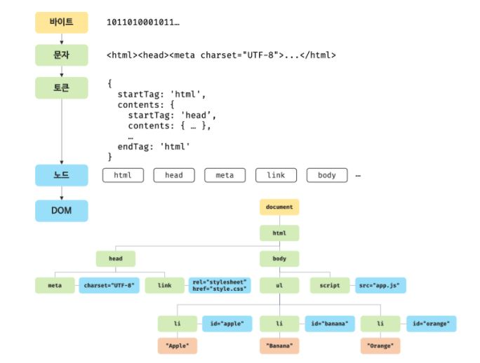
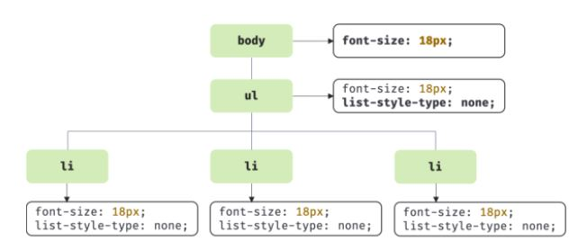
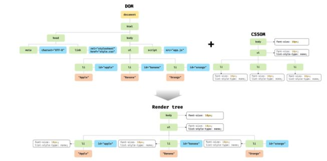
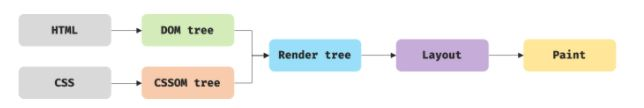
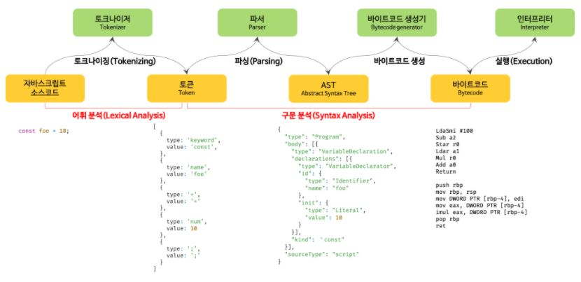

# 브라우저의 렌더링 과정

대부분의 프로그래밍 언어는 운영체제(Operating System, OS)나 가상 머신(Virtual Machine, VM) 위에서 실행되지만 웹 애플리케이션의 클라이언트 사이드 자바스크립트는 브라우저에서 HTML, CSS와 함께 실행된다. 따라서 **브라우저 환경을 고려할 때** 더 효율적인 클라이언트 사이드 자바스크립트 프로그래밍이 가능하다.

다음은 브라우저의 렌더링 과정이다.

1. 서버에 HTML, CSS, JS, 폰트 파일, 이미지 등 필요한 파일들을 요청하여 받는다.
2. 브라우저의 렌더링 엔진은 HTML을 파싱하여 DOM을, CSS를 파싱하여 CSSOM을 만들어 렌더 트리를 생성한다.
3. 브라우저의 자바스크립트 엔진은 자바스크립트 소스 코드를 파싱하여 AST(추상구문트리)를 만들고 이를 바이트 코드로 변환하여 실행하는데, 이 때 DOM API를 사용하여 만들어진 DOM이나 CSSOM을 변경할 수 있다. 변경된 DOM과 CSSOM은 다시 렌더 트리에 결합된다.
4. 렌더 트리를 기반으로 HTML 요소의 크기와 위치를 계산하고 페인팅한다.

## 요청과 응답

브라우저의 핵심 기능은 렌더링에 필요한 리소스는 모두 서버에 존재하므로 필요한 리소스를 서버에 요청하고 서버가 응답한 리소스를 파싱하여 렌더링하는 것이다.

서버에 요청을 전송하기 위해 브라우저는 서버의 URL을 주소창을 통해 입력받는다. 입력받은 URL의 호스트에 해당하는 DNS를 통해 IP주소를 받아 해당 IP주소에 있는 서버에게 요청을 전송한다.

브라우저의 렌더링 엔진은 HTML을 파싱하는 도중에 `link`, `img`, `script` 등의 태그를 만나면 HTML 파싱을 잠시 중단하고 서버에 해당 리소스 파일을 서버로 요청한다.

---

## HTTP 1.1과 HTTP 2.0

HTTP/1.1은 기본적으로 커넥션(connection)당 하나의 요청과 응답만 처리한다. 즉, 여러 개의 요청을 한 번에 전송할 수 없고 응답 또한 마찬가지다. 따라서 HTML 문서 내에 포함된 여러 개의 리소스 요청이 개별적으로 전송되고 응답 또한 개별적으로 전송된다. 이처럼 HTTP/1.1은 리소스의 동시 전송이 불가능한 구조이므로 요청할 리소스의 개수에 비례하여 응답 시간도 증가하는 단점이 있다.

HTTP/2는 커넥션당 여러 개의 요청과 응답, 즉 다중 요청/응답이 가능하다. 따라서 HTTP/2.0은 여러 리소스의 동시 전송이 가능하므로 HTTP/1.1에 비해 페이지 로드 속도가 약 50% 정도 빠르다고 알려져 있다.

---

## HTML 파싱과 DOM 생성

브라우저의 요청에 의해 서버가 응답한 HTML 문서는 문자열로 이루어진 순수한 텍스트다. 순수한 텍스트인 HTML 문서를 브라우저에 시각적인 픽셀로 렌더링하려면 HTML 문서를 브라우저가 이해할 수 있는 자료구조(객체)인 DOM(Document Object Model)을 생성하여 메모리에 저장해야 한다.

다음은 DOM 생성 과정이다.

1. 서버는 요청받은 HTML 파일을 찾아 메모리에 저장한 다음 바이트 단위로 응답한다.
2. 브라우저는 응답 받은 HTML 파일(2진수)를 meta 태그의 charset 어트리뷰트에 저장된 인코딩 방식으로 2진수를 문자열로 변환한다. 이 charset 어트리뷰트는 response header에 담겨 응답된다.
3. 변환한 문자열로 된 HTML 파일을 문법적 의미를 갖는 최소 단위인 토큰으로 분해한다.
4. 각 토큰을 객체로 변환하여 노드를 생성한다. 노드는 토큰의 내용에 따라 문서, 요소, 어트리뷰트, 텍스트 노드 등으로 나뉜다.
5. HTML 요소들은 중첩 관계를 가지기 때문에, 부자 관계를 반영하여 모든 노드들을 트리 자료구조로 구성한다. 이 트리 자료구조가 DOM이다.



---

## CSS 파싱과 CSSOM 생성

HTML 파일을 토큰으로 분해하고, 이 토큰들을 바탕으로 만든 노드로 DOM을 형성하는 과정에서 `<head>` 태그에서 `<link rel="stylesheet" href="style.css">` 와 같은 link 태그를 만나면 DOM 생성을 잠시 멈추고, `href` 어트리뷰트에 지정된 CSS파일을 서버에 요청하여 받은 2진수들을 문자열로 변환하고, 토큰으로 분해한 후 이를 바탕으로 노드를 만들어 CSSOM을 생성한다.



---

## 렌더 트리 생성

렌더 트리는 렌더링을 위한 자료구조이기 때문에, HTML의 렌더링되지 않는 노드(meta 태그, script 태그 등)와 CSS에 의해 표시되지 않는 노드(`dipslay: none` 등)들은 렌더 트리에 포함되지 않는다.



완성된 렌더 트리는 HTML 요소의 레이아웃을 계산하여 픽셀을 렌더링하여 페인팅 처리에 사용된다.



다음은 레이아웃 계산과 페인팅을 재실행하게 하여 성능에 악영향을 주는 작업들이다.

1. JS에 의한 노드 추가 또는 삭제
2. 창 크기 변경에 따른 뷰포트 크기 변경
3. JS에 의한 HTML 레이아웃에 변경을 발생시키는 스타일 변경

   `width`, `height`, `margin`, `padding`, `border` 등

---

## 자바스크립트 파싱과 실행

DOM은 HTML 문서의 구조와 정보뿐만 아니라 HTML 요소와 스타일 등을 변경할 수 있는 프로그래밍 인터페이스로서 DOM API를 제공한다.

CSS 파싱 과정과 마찬가지로 렌더링 엔진은 HTML을 한 줄씩 순차적으로 파싱하며 DOM을 생성해 나가다가 자바스크립트 파일을 로드하는 script 태그나 자바스크립트 코드를 콘텐츠로 담은 script 태그를 만나면 DOM 생성을 일시 중단한다. 그리고 script 태그의 src 어트리뷰트에 정의된 자바스크립트 파일을 서버에 요청하여 로드한 자바스크립트 파일이나 script 태그 내의 자바스크립트 코드를 파싱하기 위해 **자바스크립트 엔진에 제어권을 넘긴다.** 이후 자바스크립트 파싱과 실행이 종료되면 렌더링 엔진으로 다시 제어권을 넘겨 HTML 파싱이 중단된 지점부터 다시 HTML 파싱을 시작하여 DOM 생성을 재개한다.

자바스크립트 엔진은 자바스크립트 코드를 파싱하여 CPU가 이해할 수 있는 저수준 언어(low-level language)로 변환하고 실행하는 역할을 한다.

렌더링 엔진으로부터 제어권을 넘겨받은 자바스크립트 엔진은 자바스크립트 코드를 파싱하기 시작한다. 렌더링 엔진이 HTML과 CSS를 파싱하여 DOM과 CSSOM을 생성하듯이 자바스크립트 엔진은 자바스크립트를 해석하여 AST(Abstract Syntax Tree, 추상적 구문 트리)를 생성한다. 그리고 AST를 기반으로 인터프리터가 실행할 수 있는 중간 코드(intermediate code)인 바이트코드를 생성하여 실행한다.



1. 토크나이징

   문자열인 소스코드를 어휘 분석하여 문법적으로 의미를 갖는 최소 단위인 토큰으로 분해한다.

2. 파싱

   토큰들의 집합을 구문 분석(syntactic analysis)하여 AST(Abstract Syntax Tree, 추상적 구문 트리)를 생성한다. AST는 토큰에 문법적 의미와 구조를 반영한 트리 구조의 자료구조다. AST는 인터프리터나 컴파일러만이 사용하는 것은 아니다. AST를 사용하면 TypeScript, Babel, Prettier 같은 트랜스파일러(transpiler)를 구현할 수도 있다.

3. 바이트코드 생성과 실행

   AST는 인터프리터가 실행할 수 있는 중간 코드인 바이트코드로 변환되고 인터프리터에 의해 실행된다

---

## 리플로우와 리페인트

DOM이나 CSSOM을 변경하는 DOM API가 사용된 경우 DOM이나 CSSOM이 변경된다. 이때 변경된 DOM과 CSSOM은 다시 렌더 트리로 결합되고 변경된 렌더 트리를 기반으로 레이아웃과 페인트 과정을 거쳐 브라우저의 화면에 다시 렌더링한다. 이를 리플로우(reflow), 리페인트(repaint)라 한다.

리플로우는 레이아웃 계산을 다시 하는 것을 말하며, 노드 추가/삭제, 요소의 크기/위치 변경, 윈도우 리사이징 등 레이아웃에 영향을 주는 변경이 발생한 경우에 한하여 실행된다. 리페인트는 재결합된 렌더 트리를 기반으로 다시 페인트를 하는 것을 말한다.

리플로우와 리페인트가 반드시 순차적으로 동시에 실행되는 것은 아니다. **레이아웃에 영향이 없는 변경은 리플로우 없이 리페인트만 실행된다.**

---

## 자바스크립트 파싱에 의한 HTML 파싱 중단

브라우저는 동기적(synchronous)으로, 즉 위에서 아래 방향으로 순차적으로 HTML, CSS, 자바스크립트를 파싱하고 실행한다. 이것은 script 태그의 위치에 따라 HTML 파싱이 블로킹되어 DOM 생성이 지연될 수 있다는 것을 의미한다. 따라서 script 태그의 위치는 중요한 의미를 갖는다.

script 태그를 만나서 DOM 생성을 중지하고, 자바스크립트 코드를 파싱하고 실행할 때, 코드 안에 DOM에 아직 생성되지 않아 포함되지 않은 요소를 조작하려 한다면, 문제가 발생하게 될 것이다. 이러한 문제를 회피하기 위해 body 요소의 가장 아래에 자바스크립트를 위치시키기도 한다.

body 요소 가장 아래에 자바스크립트를 위치시키면 다음과 같은 장점이 있다.

1. DOM이 완성되지 않은 상태에서 자바스크립트가 DOM을 조작하면 문제가 발생할 수 있다.
2. 렌더 트리가 완성되기 전에 자바스크립트를 로딩, 파싱, 실행하지 않기 때문에 페이지 로딩 시간이 단축된다. (? 어차피 자바스크립트를 모두 실행하고 그 다음에 렌더링하는 거 아니었나..?)

---

## script 태그의 async / defer 어트리뷰트

자바스크립트 파싱에 의한 DOM 생성이 중단(blocking)되는 문제를 근본적으로 해결하기 위해 HTML5부터 script 태그에 async와 defer 어트리뷰트가 추가되었다.

async와 defer 어트리뷰트는 다음과 같이 src 어트리뷰트를 통해 외부 자바스크립트 파일을 로드하는 경우에만 사용할 수 있다. 즉, src 어트리뷰트가 없는 인라인 자바스크립트에는 사용할 수 없다.

```HTML

<script async src="extern.js"></script>
<script defer src="extern.js"></script>

```

async와 defer 어트리뷰트를 사용하면 HTML 파싱과 외부 자바스크립트 파일의 로드가 비동기적(asynchronous)으로 동시에 진행된다. 하지만 자바스크립트의 실행 시점에 차이가 있다.

1. async

   HTML의 파싱이 자바스크립트의 로딩과 비동기적으로 진행되지만, 자바스크립트의 파싱과 실행을 할 때에는 HTML 파싱이 중단된다. 또한, 여러 script 태그에 async 어트리뷰트를 주면, 로딩이 완료된 자바스크립트부터 실행하기 때문에, 순서가 필요한 자바스크립트의 경우 async 어트리뷰트를 사용하면 문제가 발생할 수 있다.

   

2. defer

   async와 마찬가지로 HTML 파싱과 자바스크립트의 로드가 비동기적으로 진행되지만, 자바스크립트의 파싱과 실행은 HTML의 파싱이 완료된 직후에 `DOMContentLoaded `이벤트가 발생하고 이 이벤트가 발생하여야 하게 된다. 따라서 DOM 생성이 완료된 이후 실행되어야 할 자바스크립트에 유용하다.

   
