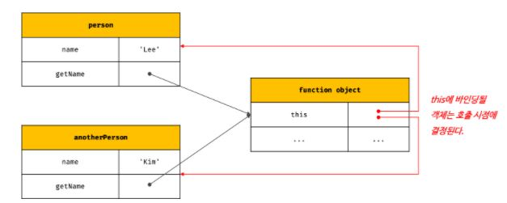

# this

## this 키워드

객체 리터럴로 생성된 객체는 식별자에 할당되기 직전에 평가되지만, 메서드가 호출되는 시점에는 이미 객체 리터럴의 평가가 완료되어 객체가 생성된 후이기 때문에, 메서드 내부에서 식별자를 재귀적으로 참조할 수 있다. 그러나, 자신이 속한 객체를 재귀적으로 참조하는 방식은 일반적이지 않고, 바람직하지 않다.

생성자 함수는 `new` 연산자와 함께 생성자 함수를 호출하는 단계에서 객체를 생성하기 때문에, 인스턴스를 가리키는 식별자를 알 수 없다. 이를 위해 javascript는 자신이 속한 객체 또는 자신이 생성할 인스턴스를 가리키는 자기 참조 변수인 `this`를 통해 생성자 함수 또는 객체 리터럴 내에서 생성할 객체 또는 인스턴스를 참조한다.

그렇다면 `this`는 항상 생성할 객체 또는 인스턴스를 참조하는 것일까?

---

## 함수 호출 방식과 this 바인딩

`this` 바인딩은 함수 호출 방식에 따라 동적으로 결정된다. 함수를 호출하는 방식은 다음 4가지와 같다.

1. 일반 함수로 호출

   `this`는 전역 객체인 `globalThis`에 바인딩된다. 단, strict mode가 적용된 일반 함수 내의 `this`는 `undefined`에 바인딩된다. 또한, 메서드 내에서 정의한 중첩 함수 또는 메서드에게 전달한 콜백 함수(보조 함수)가 일반 함수로 호출될 때 메서드 내의 중첩 함수 또는 콜백 함수의 `this`도 전역 객체를 바인딩한다. 이는 메서드 내의 중첩 함수 또는 콜백 함수의 `this`는 헬퍼 함수로 동작하기 어렵게 만들고, 이를 해결하기 위해 밑의 방식을 활용한다.

   ```javascript

   var name = 'thiago';

   const fabinho = {
       name: 'fabinho',
       myName() {
           console.log(this); // fabinho {name: 'fabinho', myName: f}
           console.log(this.name); // fabinho

           const that = this;

           setTimeout(function () {
               console.log(this); // globalThis
               console.log(this.name); // thiago
               console.log(that.name); // fabinho
           }, 100);

           myName2() {
               console.log(this); // globalThis
               console.log(this.name); // thiago
               console.log(that.name); // fabinho
           }
       },

   };

   ```

2. 메서드로 호출

   메서드를 호출한 객체에 바인딩된다. 이는 메서드를 소유한 객체가 아니라, 메서드를 호출한 객체에 바인딩되는 것으로, 메서드 이름 앞의 마침표 연산자 앞의 기술한 객체를 뜻한다.

   메서드는 각 프로퍼티 키가 독립적으로 존재하는 별도의 함수 객체를 가리키고 있고, 이는 곧 다른 객체의 프로퍼티에 할당될 수 있거나, 일반 함수로 호출될 수 있다는 것을 뜻한다. 따라서, 메서드 내부의 `this`는 프로퍼티로 메서드를 가리키고 있는 객체가 아니라 메서드를 호출한 객체에 바인딩된다. 프로토타입 메서드 내부에서 사용된 `this`도 일반 메서드와 마찬가지로 해당 메서드를 호출한 객체에 바인딩된다.

   

   ```javascript
   function Player(name) {
     this.name = name;
   }

   Player.prototype.getName = function () {
     return this.name;
   };

   const me = new Player('thiago');

   console.log(me.getName()); // thiago

   Player.prototype.name = 'arnold';

   console.log(Player.prototype.getName()); // arnold
   ```

3. 생성자 함수로 호출

   생성자 함수가 생성한 인스턴스에 바인딩된다.

   ```javascript
   function Player(name) {
     this.name = name;
   }

   Player.prototype.myName = function () {
     return this.name; // 생성할 인스턴스에 바인딩된다.
   };
   ```

4. `Function.prototype.apply/call/bind` 메서드에 의한 간접 호출

   `Function.prototype.apply/call/bind` 는 모든 함수 객체 프로토타입의 메서드이기 때문에, 모든 함수가 프로토타입 체인에 의해 사용할 수 있다.

   이 중 `apply` 와 `call` 메서드는 인수로 함수 내의 `this`와 바인딩할 객체와 인수 리스트를 받아, 함수 내 동작을 끝내고 반환한다. `apply` 메서드는 호출할 함수의 인수를 유사 배열 객체로 받고, `call` 메서드는 인수를 쉼표로 구분하여 받는다.

   ```javascript
   function getPlayer() {
     return `name : ${this.name}, reputation : ${arguments[0]}, type : ${arguments[1]}`;
   }

   const thiago = {
     name: 'thiago',
   };

   console.log(getPlayer.apply(thiago, ['world class', 'technical'])); // name : thiago, reputation : world class, type : technical
   console.log(getPlayer.call(thiago, 'world class', 'technical')); // name : thiago, reputation : world class, type : technical
   ```

   `apply`와 `call` 메서드의 대표적인 용도는 `arguments` 객체와 같은 유사 배열 객체에 배열 메서드를 사용하는 경우다. `arguments` 객체는 배열이 아니기 때문에 `Array.prototype.slice` 같은 배열의 메서드를 사용할 수 없으나 `apply`와 `call` 메서드를 이용하면 가능하다.

   ```javascript
   function getPlayer() {
     // arguments.배열 메서드 => 사용 불가
     const arr = Array.prototype.slice.call(arguments); // Array.prototype.slice를 인수 없이 호출하면 배열의 복사본 생성
     // arr.배열 메서드 => 사용 가능
     return arr;
   }

   const players = ['thiago', 'fabinho', 'robertson'];
   console.log(getPlayer(players)); // [ [ 'thiago', 'fabinho', 'robertson' ] ]
   ```

   `bind` 메서드는 함수를 호출하지 않고 함수 내에서 `this`와 바인딩될 객체를 전달한다. `bind` 메서드는 주로 메서드의 `this`와 메서드 내부의 중첩 함수나 콜백 함수 내의 `this`가 불일치하는 문제를 해결하기 위해 사용된다.

   ```javascript
   const thiago = {
     name: 'thiago',
     passBall(callback) {
       setTimeout(callback.bind(this), 100);
     },
   };

   const drivenPass = function () {
     console.log(`${this.name} delivered ball with driven pass`);
   };

   thiago.passBall(drivenPass); // thiago delivered ball with driven pass
   ```
