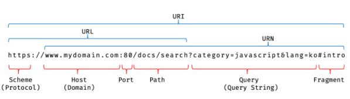

# 빌트인 객체

## 자바스크립트 객체의 분류

1. 표준 빌트인 객체

   ECMAScript 사양에 정의된 객체로, 자바스크립트 실행 환경에 상관없이 언제나 사용할 수 있고, 전역 객체의 프로퍼티로서 제공된다.

2. 호스트 객체

   ECMAScript 사양에 정의되어 있지 않지만 자바스크립트 실행 환경에 따라 추가로 제공하는 객체이다.

3. 사용자 정의 객체

   사용자가 직접 정의한 객체이다.

---

## 표준 빌트인 객체

생성자 함수 객체인 표준 빌트인 객체는 프로토타입 메서드와 정적 메소드를 제공하고 생성자 함수 객체가 아닌 표준 빌트인 객체는 정적 메소드만 제공한다.

표준 빌트인 객체의 prototype 프로퍼티에 바인딩된 객체(예를 들어, `String.prototype`)는 다양한 기능의 빌트인 프로토타입 메서드를 제공한다. 그리고 표준 빌트인 객체는 인스턴스 없이도 호출 가능한 빌트인 정적 메서드를 제공한다.

```javascript
// Number 생성자 함수에 의한 Number 객체 생성
const numObj = new Number(1.5); // Number {1.5}

// toFixed는 Number.prototype의 프로토타입 메서드다.
// Number.prototype.toFixed는 소수점 자리를 반올림하여 문자열로 반환한다.
console.log(numObj.toFixed()); // 2

// isInteger는 Number의 정적 메서드다.
// Number.isInteger는 인수가 정수(integer)인지 검사하여 그 결과를 Boolean으로 반환한다.
console.log(Number.isInteger(0.5)); // false
```

---

## 원시값과 래퍼 객체

원시값은 리터럴로 생성할 수 있는데 왜 굳이 생성자 함수가 존재하는 것일까?

이는 원시값이 생성자 함수의 프로토타입의 메서드를 사용할 수 있게 하기 위해서이다. 원시값에 프로퍼티 접근 연산자로 접근하면 엔진은 생성자 함수를 암묵적으로 호출하여 일시적 객체인 래퍼 객체를 생성한다. 이 래퍼 객체는 생성자 함수의 프로토타입과 프로토타입 체인을 형성하기 때문에 프로토타입의 메서드나 프로퍼티를 참조할 수 있게 된다.

## 문자열, 숫자, 불리언, 심벌 이외의 원시값, 즉 `null`과 `undefined`는 래퍼 객체를 생성하지 않는다. 따라서 `null`과 `undefined` 값을 객체처럼 사용하면 에러가 발생한다.

## 전역 객체

전역 객체는 자바스크립트 환경에 따라 지칭하는 이름이 제각각이다. 브라우저 환경에서는 `window`(또는 self, this, frames)가 전역 객체를 가리키지만 Node.js 환경에서는 `global`이 전역 객체를 가리킨다.

```javascript
// 브라우저 환경
globalThis === this; // true
globalThis === window; // true
globalThis === self; // true
globalThis === frames; // true

// Node.js 환경(12.0.0 이상)
globalThis === this; // true
globalThis === global; // true
```

전역 객체는 프로토타입 상속 관계상에서 최상위 객체가 아니며, 어떤 객체의 프로퍼티도 아니며, 표준 빌트인 객체와 호스트 객체를 프로퍼티로 소유한다.

브라우저 환경의 모든 자바스크립트 코드는 하나의 전역 객체 `window`를 공유한다. 여러 개의 script 태그를 통해 자바스크립트 코드를 분리해도 하나의 전역 객체 `window`를 공유하는 것은 변함이 없다. 이는 분리되어 있는 자바스크립트 코드가 하나의 전역을 공유한다는 의미다.

---

### 빌트인 전역 프로퍼티

- `Infinity`

  `Infinity` 프로퍼티는 무한대를 나타내는 숫자값 `Infinity`를 갖는다.

- `NaN`

  `NaN` 프로퍼티는 숫자가 아님(Not-a-Number)을 나타내는 숫자값 `NaN`을 갖는다. `NaN` 프로퍼티는 `Number.NaN` 프로퍼티와 같다.

- `undefined`

  `undefined` 프로퍼티는 원시 타입 `undefined`를 값으로 갖는다.

### 빌트인 전역 함수

- `eval`

  `eval` 함수는 자바스크립트 코드를 나타내는 문자열을 인수로 전달받는다. 전달받은 문자열 코드가 표현식이라면 `eval` 함수는 문자열 코드를 런타임에 평가하여 값을 생성하고, 전달받은 인수가 표현식이 아닌 문이라면 `eval` 함수는 문자열 코드를 런타임에 실행한다. 문자열 코드가 여러 개의 문으로 이루어져 있다면 모든 문을 실행한다.

  함수를 호출하면, 런타임 이전에 함수 몸체 내부의 모든 선언문을 먼저 실행하고 스코프에 등록한다. 하지만 `eval` 함수는 기존의 스코프를 런타임에 동적으로 수정한다.

  ```javascript
  const x = 1;

  function foo() {
    // eval 함수는 런타임에 foo 함수의 스코프를 동적으로 수정한다.
    eval('var x = 2;');
    console.log(x); // 2
  }

  foo();
  console.log(x); // 1
  ```

  strict mode에서 `eval` 함수는 기존의 스코프를 수정하지 않고 **`eval` 함수 자신의 자체적인 스코프를 생성**한다.

  ```javascript
  const x = 1;

  function foo() {
    'use strict';

    // strict mode에서 eval 함수는 기존의 스코프를 수정하지 않고 eval 함수 자신의 자체적인 스코프를 생성한다.
    eval('var x = 2; console.log(x);'); // 2
    console.log(x); // 1
  }

  foo();
  console.log(x); // 1
  ```

  또한 인수로 전달받은 문자열 코드가 `let`, `const` 키워드를 사용한 변수 선언문이라면 암묵적으로 strict mode가 적용된다.

  `eval` 함수의 단점은 다음과 같다.

  - `eval` 함수를 통해 사용자로부터 입력받은 코드를 실행하는 것은 보안에 매우 취약하다.

  - `eval` 함수를 통해 실행되는 코드는 엔진에 의해 최적화가 안되어 성능이 좋지 않다.

  따라서, `eval` 함수 사용은 하지 않는 것이 좋다.

- `isFinite`

  전달받은 인수가 정상적인 유한수인지 검사하여 유한수이면 `true`를 반환하고, 무한수이면 `false`를 반환한다. 전달받은 인수의 타입이 숫자가 아닌 경우, 숫자로 타입을 변환한 후 검사를 수행한다. 이때 인수가 `NaN`으로 평가되는 값이라면 `false`를 반환한다.

  `isFinite(null)`은 `true`를 반환한다. 이것은 `null`을 숫자로 변환하여 검사를 수행했기 때문이다. `null`을 숫자 타입으로 변환하면 0이 된다.

- `isNaN`

  전달받은 인수가 `NaN`인지 검사하여 그 결과를 불리언 타입으로 반환한다. 전달받은 인수의 타입이 숫자가 아닌 경우 숫자로 타입을 변환한 후 검사를 수행한다.

- `parseFloat`

  전달받은 문자열 인수를 부동 소수점 숫자(floating point number), 즉 실수로 해석(parsing)하여 반환한다.

- `parseInt`

  전달받은 문자열 인수를 정수(integer)로 해석(parsing)하여 반환한다.

  두 번째 인수로 진법을 나타내는 기수(2 ~ 36)를 전달할 수 있다. 기수를 지정하면 첫 번째 인수로 전달된 문자열을 해당 기수의 숫자로 해석하여 반환한다. 이때 반환값은 언제나 10진수다. 기수를 생략하면 첫 번째 인수로 전달된 문자열을 10진수로 해석하여 반환한다.

  두 번째 인수로 진법을 나타내는 기수를 지정하지 않더라도 첫 번째 인수로 전달된 문자열이 “0x” 또는 “0X”로 시작하는 16진수 리터럴이라면 16진수로 해석하여 10진수 정수로 반환한다. 하지만 2진수 리터럴과 8진수 리터럴은 제대로 해석하지 못한다.

  ```javascript
  parseInt('0xf'); // 15
  parseInt('f', 16); // 15
  parseInt('0b10'); // 0 이후가 무시된다. 0
  parseInt('0o10'); // 0 이후가 무시된다. 0
  ```

  첫 번째 인수로 전달한 문자열의 첫 번째 문자가 해당 지수의 숫자로 변환될 수 없다면 `NaN`을 반환한다.

  하지만 첫 번째 인수로 전달한 문자열의 두 번째 문자부터 해당 진수를 나타내는 숫자가 아닌 문자(예를 들어 2진수의 경우 2)와 마주치면 이 문자와 계속되는 문자들은 전부 무시되며 해석된 정수값만 반환한다.

  첫 번째 인수로 전달한 문자열에 공백이 있다면 첫 번째 문자열만 해석하여 반환하며 앞뒤 공백은 무시된다. 만일 첫 번째 문자열을 숫자로 해석할 수 없는 경우 `NaN`을 반환한다.

  첫 번째 인수로 전달한 문자열에 공백이 있다면 첫 번째 문자열만 해석하여 반환하며 앞뒤 공백은 무시된다. 만일 첫 번째 문자열을 숫자로 해석할 수 없는 경우` NaN`을 반환한다.

  ```javascript
  // 'A'는 10진수로 해석할 수 없다.
  parseInt('A0'); // -> NaN
  // '2'는 2진수로 해석할 수 없다.
  parseInt('20', 2); // -> NaN

  // 10진수로 해석할 수 없는 'A' 이후의 문자는 모두 무시된다.
  parseInt('1A0'); // -> 1
  // 2진수로 해석할 수 없는 '2' 이후의 문자는 모두 무시된다.
  parseInt('102', 2); // -> 2
  // 8진수로 해석할 수 없는 '8' 이후의 문자는 모두 무시된다.
  parseInt('58', 8); // -> 5
  // 16진수로 해석할 수 없는 'G' 이후의 문자는 모두 무시된다.
  parseInt('FG', 16); // -> 15

  // 공백으로 구분된 문자열은 첫 번째 문자열만 변환한다.
  parseInt('34 45 66'); // -> 34
  parseInt('40 years'); // -> 40
  // 첫 번째 문자열을 숫자로 변환할 수 없다면 NaN을 반환한다.
  parseInt('He was 40'); // -> NaN
  // 앞뒤 공백은 무시된다.
  parseInt(' 60 '); // -> 60
  ```

- `encdoeURI` / `decodeURI`

  `encodeURI` 함수는 완전한 URI(Uniform Resource Identifier)를 문자열로 전달받아 이스케이프 처리를 위해 인코딩한다. URI는 인터넷에 있는 자원을 나타내는 유일한 주소를 말한다. URI의 하위개념으로 URL, URN이 있다.

  

  이스케이프 처리는 네트워크를 통해 정보를 공유할 때 어떤 시스템에서도 읽을 수 있는 아스키 문자 셋(ASCII Character-set)으로 변환하는 것이다.

  URI 문법 형식 표준 RFC3986에 따르면 URL은 아스키 문자 셋으로만 구성되어야 하며 한글을 포함한 대부분의 외국어나 아스키 문자 셋에 정의되지 않은 특수 문자의 경우 URL에 포함될 수 없다. 따라서 **URL 내에서 의미를 갖고 있는 문자** (`%, ?, #`)나 **URL에 올 수 없는 문자** (한글, 공백 등) 또는 **시스템에 의해 해석될 수 있는 문자** (`<, >`)를 이스케이프 처리하여 야기될 수 있는 문제를 예방하기 위해 이스케이프 처리가 필요하다. 단, 알파벳, 0~9의 숫자, `- _ . ! ~ * ‘ ( )` 문자는 이스케이프 처리에서 제외된다.

  decodeURI 함수는 인코딩된 URI를 인수로 전달받아 이스케이프 처리 이전으로 디코딩한다.

- `encodeURIComponent` / `decodeURIComponent`

  encodeURIComponent 함수는 인수로 전달된 문자열을 URI의 구성요소인 쿼리 스트링의 일부로 간주한다. 따라서 쿼리 스트링 구분자로 사용되는 `=, ?, &`까지 인코딩한다.

  반면 encodeURI 함수는 매개변수로 전달된 문자열을 완전한 URI 전체라고 간주한다. 따라서 쿼리 스트링 구분자로 사용되는 `=, ?, &`은 인코딩하지 않는다.

---

### 암묵적 전역

암묵적 전역이란 선언하지 않은 식별자에 값을 할당하면, `전역객체.식별자 = 값`이라고 해석하여 전역객체에 프로퍼티를 동적 생성하여, 전역 변수처럼 동작하도록 하는 자바스크립트 엔진의 동작을 말한다.

```javascript
var x = 10; // 전역 변수

function foo() {
  // 선언하지 않은 식별자에 값을 할당
  y = 20; // window.y = 20;
}
foo();

// 선언하지 않은 식별자 y를 전역에서 참조할 수 있다.
console.log(x + y); // 30
```

여기서 `y`는 변수 선언 없이 전역 객체의 프로퍼티로 동적 추가되었을 뿐이기 때문에, 변수가 아니고, 따라서 변수 호이스팅도 발생하지 않는다. 또한, 또한 변수가 아니라 단지 프로퍼티인 `y`는 `delete` 연산자로 삭제할 수 있다. 전역 변수는 프로퍼티이지만` delete` 연산자로 삭제할 수 없다.
