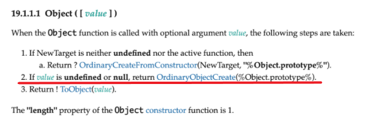
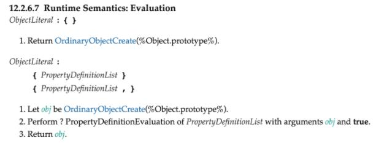
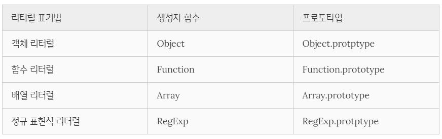

# 프로토타입

## 객체지향 프로그래밍

다양한 속성 중에서 프로그램에 필요한 속성만 간추려 내어 표현하는 것을 **추상화(abstraction)라 한다.** 속성을 통해 **여러 개의 값을 하나의 단위로 구성한 복합적인 자료구조**를 객체라고 하며, 속성은 **상태를 나타내는 데이터** 와 **동작**으로 나눌 수 있다. 즉 객체는 상태 데이터와 동작을 하나의 논리적인 단위로 묶은 복합적인 자료구조라고 할 수 있다.

---

## 상속과 프로토타입

상속은 객체의 프로퍼티 또는 메서드를 다른 객체가 받아서 그대로 사용할 수 있는 것을 말한다. 상속은 **기존 코드를 재사용** 하여 개발 비용을 줄이려는 의도를 가진다.

```javascript
function Player(name) {
  this.name = name;
  this.passBall = function (target) {
    return `passed ball to ${target}`;
  };
}

const thiago = new Player('thiago');
const hyorard = new Player('hyorard');

console.log(thiago.passBall === hyorard.passBall); // false

console.log(thiago.passBall('firmino'));
console.log(hyorard.passBall('salah'));
```

생성자 함수에서 동일한 내용의 메서드를 정의하면 문제가 발생한다. 동작하는 것은 정확하게 일치하지만, 생성한 객체마다 메서드를 중복 생성하고, 중복 소유하게 된다. 이는 **메모리를 불필요하게 낭비하게 하며, 인스턴스 생성 시마다 메서드를 생성하므로 성능에도 악영향을 준다.**

이는 프로토타입을 사용하면 해결할 수 있다.

```javascript
function Player(name) {
  this.name = name;
}

Player.prototype.passBall = function (target) {
  return `passed ball to ${target}`;
};

const thiago = new Player('thiago');
const hyorard = new Player('hyorard');

console.log(thiago.passBall === hyorard.passBall); // true

console.log(thiago.passBall('firmino'));
console.log(hyorard.passBall('salah'));
```

프로토타입에 중복 메서드를 정의하여 상속을 통해 공유하여 사용하게 하면, 상태를 나타내는 `name` 프로퍼티만 개별적으로 소유하여 사용하게 된다.

---

## 프로토타입 객체

모든 객체는 `[[Prototype]]`이라는 내부 슬롯을 가지며, 이 내부 슬롯의 값은 프로토타입의 참조(`null`인 경우도 있다)다. `[[Prototype]]`에 저장되는 프로토타입은 객체 생성 방식에 의해 결정된다. 즉, 객체가 생성될 때 객체 생성 방식에 따라 프로토타입이 결정되고 `[[Prototype]]`에 저장된다.

모든 객체는 0개 또는 하나의 프로토타입을 갖는다. 0개인 경우는 객체의 프로토타입이 `null`인 객체(지금 생각나는 것은 프로토타입 체인의 종점에 위치한 `Object.prototype` 밖에 없다.)이고, 나머지는 모두 하나의 프로토타입을 갖는다.

`[[Prototype]]` 내부 슬롯에는 직접 접근할 수 없지만, 위 그림처럼 `__proto__` 접근자 프로퍼티를 통해 자신의 프로토타입, 즉 자신의 `[[Prototype]]` 내부 슬롯이 가리키는 프로토타입에 간접적으로 접근할 수 있다.

### `__proto__` 접근자 프로퍼티

1. `__proto__`는 접근자 프로퍼티이다.

   `[[Prototype]]` 은 객체의 프로퍼티가 아니기 때문에, `[[Prototype]]` 내부 슬롯에도 직접 접근할 수 없으며 `__proto__` 접근자 프로퍼티를 통해 간접적으로 `[[Prototype]] `내부 슬롯의 값, 즉 프로토타입에 접근할 수 있다.

   접근자 프로퍼티는 어트리뷰트 값으로 `[[Get]]`, `[[Set]]`, `[[Enumerable]]`, `[[Configurable]]` 을 가지는데, `__proto__`는 `getter`와 `setter` 함수라고 부르는 접근자 함수를 통해 프로토타입을 취득하거나 할당하게 된다.

   ```javascript
   const player = { hasLicense: true };
   const hyorard = { name: 'hyo' };

   console.log(hyorard.__proto__); // getter 함수로 hyorard 객체의 프로토타입을 취득
   hyorard.__proto__ = player; // setter 함수로 hyorard 객체의 프로토타입을 교체

   console.log(hyorard.hasLicense);
   ```

2. `__proto__`는 상속받은 접근자 프로퍼티이다.

   `__proto__` 접근자 프로퍼티는 객체 마다 가지는 접근자 프로퍼티가 아닌, `Object.prototype`으로부터 상속받은 접근자 프로퍼티이다.

3. `__proto__` 접근자 프로퍼티는 상호 참조를 방지한다.

   ```javascript
   const player = { hasLicense: true };
   const hyorard = { name: 'hyo' };

   hyorard.__proto__ = player; // setter 함수로 hyorard 객체의 프로토타입을 교체
   player.__proto__ = hyorard; // TypeError: Cyclic __proto__ value
   ```

   프로토타입 체인은 단방향 링크드 리스트로 구현되어야 한다. 위와 같은 식으로 순환 참조하는 프로토타입 체인이 만들어진다면 프로토타입 체인의 종점이 존재하지 않아 프로퍼티를 검색할 때, 무한 루프에 빠지게 된다.

4. `__proto__` 접근자 프로퍼티를 사용하면 안되는 경우가 있다.

   `__proto__` 접근자 프로퍼티는 ES5까지 ECMAScript 사양에 포함되지 않은 비표준이었다. 하지만 일부 브라우저에서 `__proto__`를 지원하고 있었기 때문에 브라우저 호환성을 고려하여 ES6에서 `__proto__`를 표준으로 채택했다. 현재 대부분의 브라우저(IE 11 이상)가 `__proto__`를 지원한다.

   ```javascript
   const atom = Object.create(null);

   // atom 은 Object.prototype을 상속받지 않는다.
   console.log(obj.__proto__); // undefined

   console.log(Object.getPrototypeOf(atom)); // null
   ```

   위와 같이 `Object.prototype`을 상속받지 않는 객체의 프로토타입을 참조하고 싶을 때에는 `Object.getPrototypeOf` 메서드를 사용하고, 교체하고 싶을 때에는 `Object.setPrototypeOf` 메서드를 사용하는 것이 좋다.

---

### 함수 객체의 prototype 프로퍼티

함수 객체가 소유하는 `prototype` 프로퍼티는 해당 함수가 생성자 함수로서 호출되었을 때, 생성할 인스턴스의 프로토타입을 참조한다.

---

### 프로토타입의 constructor 프로퍼티와 생성자 함수

모든 프로토타입은 `constructor` 프로퍼티를 가지고, 이는 `prototype` 프로퍼티로 자신을 가리키고 있는 생성자 함수를 참조한다.

---

## 리터럴 표기법에 의해 생성된 객체의 생성자 함수와 프로토타입

리터럴 표기법에 의해 생성된 객체의 경우 프로토타입의 constructor 프로퍼티가 가리키는 생성자 함수가 반드시 객체를 생성한 생성자 함수라고 단정할 수는 없다.

1. `Object` 생성자 함수로 객체를 생성할 경우 객체 생성 방식

   

   2번의 경우가 `Object` 생성자 함수로 객체를 생성할 경우 자바스크립트 엔진이 동작하는 방식이다. 추상연산 `OrdinaryObjectCreate`를 호출하여 `Object.prototype`을 프로토타입으로 갖는 빈 객체를 생성하여 반환한다.

2. 객체 리터럴로 객체를 생성할 경우 객체 생성 방식

   

   객체 리터럴로 객체를 생성하는 경우도 `Object` 생성자 함수로 객체를 생성하는 경우와 똑같이 동작한다. 추상연산 `OrdinaryObjectCreate`를 호출하여 `Object.prototype`을 프로토타입으로 갖는 빈 객체를 생성하여 반환한다.

이 두 방식은 결국 생성 방식이 같고, 생성한 객체의 프로토타입이 모두 `Object.prototype`이라는 것은 같다. 그러나, 객체 리터럴로 객체를 생성하는 경우 `Object` 생성자 함수가 호출되는 것이 아니라는 것을 알 수 있다.

그러나, 객체 리터럴로 생성된 객체의 프로토타입인 `Object.prototype`의 `constructor` 프로퍼티 또한 Object 생성자 함수를 가리킨다. 따라서 프로토타입의 `constructor`프로퍼티를 통해 연결되어 있는 생성자 함수를 리터럴 표기법으로 생성한 객체를 생성한 생성자 함수로 생각해도 크게 무리는 없다.

다른 리터럴 표기법으로 생성한 객체와 생성자 함수, 프로토타입은 다음과 같다.



---

## 프로토타입의 생성 시점

프로토타입은 생성자 함수가 생성되는 시점에 더불어 생성된다.

- 함수 선언문으로 정의된 생성자 함수

  런타임 전, 선언문이 평가되어 함수 객체를 생성하고, 암묵적으로 함수 이름과 같은 식별자에 할당될 때, 프로토타입도 같이 생성하고, 생성자 함수와 프로토타입이 서로 참조하게 한다.

- 함수 표현식으로 정의된 생성자 함수

  함수 리터럴이 평가될 때, 런타임을 멈추고 함수 객체를 생성하고 식별자에 할당한다. 이 때 함수 선언문과 같이 동작하는 데 더해, 생성한 객체와 프로토타입을 연결한다.

- 빌트인 생성자 함수

  `Object`, `String`, `Number`, `Function`, `Array`, `RegExp`, `Date`, `Promise` 등과 같은 빌트인 생성자 함수도 생성자 함수가 생성되는 시점에 프로토타입이 생성된다.

  위의 두 경우와 다르게, 모든 빌트인 생성자 함수는 전역 객체가 생성되는 시점에 같이 생성되기 때문에, 이 때 프로토타입을 만들고, 프로로타입과 생성자 함수는 상호 참조하게 된다. 또한, 이 때 생성된 빌트인 생성자 함수 객체들은 전역 객체의 프로퍼티가 된다.

---

## 객체 생성 방식과 프로토타입의 결정

`Object` 생성자 함수와 객체 리터럴로 생성한 객체의 프로토타입은 모두 `Object.prototype` 이지만, 함수 선언문 또는 함수 표현식과 같은 사용자 정의 생성자 함수로 객체를 생성하면 앞의 두 방식과 같이 추상연산 `OrdinaryObjectCreate`를 호출하지만 인수로 `Object.prototype`을 주는 것이 아니라, 생성자 함수의 `prototype` 프로퍼티에 바인딩되어 있는 객체를 넘겨 준다.

따라서, 생성한 인스턴스의 프로토타입 체인의 깊이가 다르다.

---

## 프로토타입 체인

프로토타입의 프로토타입은 언제나 `Object.prototype`이다.

자바스크립트는 객체의 프로퍼티(메서드 포함)에 접근하려고 할 때 해당 객체에 접근하려는 프로퍼티가 없다면 `[[Prototype]]` 내부 슬롯의 참조를 따라 자신의 부모 역할을 하는 프로토타입의 프로퍼티를 순차적으로 검색한다. 이를 프로토타입 체인이라 한다. 프로토타입 체인은 자바스크립트가 객체지향 프로그래밍의 상속을 구현하는 메커니즘이다.

`Object.prototype`을 프로토타입 체인의 종점(end of prototype chain)이라 한다. 프로토타입 체인의 종점인 `Object.prototype`에서도 프로퍼티를 검색할 수 없는 경우, `undefined`를 반환한다. 이때 에러가 발생하지 않는 것에 주의하자.

스코프 체인과 프로토타입 체인은 서로 연관없이 별도로 동작하는 것이 아니라 서로 협력하여 식별자와 프로퍼티를 검색하는 데 사용된다.

---

## 오버라이딩과 프로퍼티 섀도잉

```javascript
function Player(name) {
  this.name = name;
}

Player.prototype.passBall = function (target) {
  return `passed ball to ${target}`;
};

const thiago = new Player('thiago');

thiago.passBall = function (target) {
  return `passed to ${target} for transition`;
}; // 오버라이딩

console.log(thiago.passBall('robertson')); // passed to robertson for transition

delete thiago.passBall;

console.log(thiago.passBall('roberson;')); // passed ball to robertson

delete thiago.passBall;

console.log(thiago.passBall('roberson;')); // passed ball to robertson
// 프로토 타입 체인을 통한 set 액세스 허용하지 않기 때문에 지워지지 않음
```

---

## 프로토타입의 교체

객체의 프로토타입을 교체하는 방식은 다음 2가지와 같다. 다음 2방식으로 프로토타입을 교체하였을 경우, 교체한 프로토타입과 생성자 함수와의 연결이 끊기게 되기 때문에, 직접 다시 연결해줘야 한다.

1. 생성자 함수를 통한 프로토타입의 교체 - `생성자함수.prototype`

2. 인스턴스를 통한 프로토타입의 교체 - `Object.setPrototypeOf(객체, 교체할 프로토타입 객체)`

---

## instanceof 연산자

우변의 생성자 함수의 `prototype`에 바인딩된 객체가 좌변의 객체의 프로토타입 체인 상에 존재하면 `true`로 평가되고, 그렇지 않은 경우에는 `false`로 평가된다. `instanceof `연산자는 프로토타입의 `constructor` 프로퍼티가 가리키는 생성자 함수를 찾는 것이 아니라, 생성자 함수의 `prototype`에 바인딩된 객체가 프로토타입 체인 상에 존재하는지 확인한다.

```javascript
function Player(name) {
  this.name = name;
}

Player.prototype.passBall = function (target) {
  return `passed ball to ${target}`;
};

const thiago = new Player('thiago');

console.log(thiago instanceof Player); // true

const liverpoolPlayer = {};

Object.setPrototypeOf(thiago, liverpoolPlayer);

console.log(thiago instanceof Player); // false

console.log(thiago instanceof Object); // true
```

---

## 직접 상속

### `Object.create` 메서드로 직접 상속

이 메서드의 장점은 다음과 같다.

1. `new` 연산자 없이 객체를 생성할 수 있다.
2. 프로토타입을 지정하면서 객체를 생성할 수 있다.
3. 객체 리터럴에 의해 생성된 객체도 상속받을 수 있다.

그러나, `Object.create` 메서드는 `const atom = Object.create(null);` 과 같이 프로토타입의 종점에 위치하는 객체를 생성할 수 있고, 이는 곧 `Object.prototype`의 빌트인 메서드를 호출할 수 없는 객체를 생성할 수 있다는 것을 의미한다.

따라서, 위험을 없애기 위해 `Object.prototype`의 빌트인 메서드는 다음과 같이 간접적으로 호출하는 것이 좋다.

`Object.prototype.hasOwnProperty.call(obj, 'a'));`

나중에 알아보자..!

---

### 객체 리터럴 내부에서 `__proto__`를 통한 직접 상속

```javascript
const player = {};

const thiago = {
  name: 'thiago',
  __proto__: player,
};
```

이와 같은 방식은 상속과 동시에 프로퍼티를 쉽게 정의할 수 있다는 장점을 가지고 있다.

---

## 정적 프로퍼티/메서드

정적 프로퍼티와 메서드는 생성자 함수 객체의 프로퍼티와 메서드로, 인스턴스를 생성하지 않아도, 생성자 함수 객체를 참조하여 참조와 호출을 할 수 잇는 프로퍼티와 메서드이다.

인스턴스와 프로토타입 메서드 내에서 `this`를 사용하지 않아 해당 객체의 프로퍼티나 메서드를 참조하지 않는다면, 정적 메서드나 정적 프로퍼티로 정의하면 인스턴스를 생성하지 않아도 호출할 수 있다는 장점이 있다.

---

## 프로퍼티 존재 확인

### in 연산자와 Object.prototype.hasOwnProperty 메서드

`in` 연산자는 프로토타입 체인을 검색하는 데 반해 `Object.prototype.hasOwnProperty` 메서드는 해당 객체에 있는지만 검색한다.

---

## 프로퍼티 열거

### for...in 문

`for…in` 문은 객체의 프로토타입 체인 상에 존재하는 모든 프로토타입의 프로퍼티 중에서 프로퍼티 어트리뷰트 `[[Enumerable]]`의 값이 `true`인 프로퍼티를 순회하며 열거(enumeration)한다.

```javascript
function Player() {
  this.hasLicense = true;
}

Player.prototype.passBall = function (target) {
  return `passed ball to ${target}`;
};

const thiago = new Player();
thiago.name = 'thiago';
thiago.preferredFoot = 'right';

for (const key in thiago) {
  console.log(`${key} => ${thiago[key]}`);
} // 프로토 타입 체인 모두 검색

for (const key in thiago) {
  if (thiago.hasOwnProperty(key)) console.log(`${key} => ${thiago[key]}`);
} // 객체 자신의 프로퍼티만을 열거
```

`for...in` 문은 프로퍼티 키가 숫자일 경우 정렬하고, 문자열인 경우 원래 순서를 보장한다.

---

### Object.keys/values/entries 메서드

```javascript
function Player() {
  this.hasLicense = true;
}

Player.prototype.passBall = function (target) {
  return `passed ball to ${target}`;
};

const thiago = new Player();
thiago.name = 'thiago';
thiago.preferredFoot = 'right';

console.log(Object.keys(thiago)); // [ 'hasLicense', 'name', 'preferredFoot' ]
console.log(Object.values(thiago)); // [ true, 'thiago', 'right' ]
console.log(Object.entries(thiago)); //[[ 'hasLicense', true ], [ 'name', 'thiago' ], [ 'preferredFoot', 'right' ]]
```
